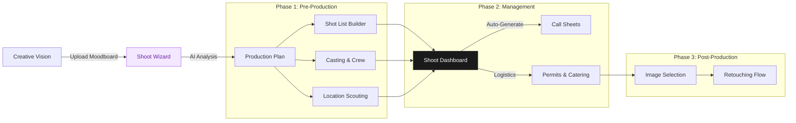

# Shoot Wizard & Production System Implementation Plan

## 📊 Progress Tracker
**Phase:** 2 - Production Planning System
**Overall Status:** 0% Complete

| Module | Status | Progress |
| :--- | :---: | :--- |
| **Infrastructure** | 🔴 Todo | 0% |
| **Concept Wizard (Steps 1-3)** | 🔴 Todo | 0% |
| **Logistics & Talent (Steps 4-6)** | 🔴 Todo | 0% |
| **AI Integration** | 🔴 Todo | 0% |
| **Production Dashboard** | 🔴 Todo | 0% |
| **Shot List Builder** | 🔴 Todo | 0% |

---

## 🗺️ Architecture Workflow



---

## 📋 Feature Page Task Matrix

| Component | Priority | Status | Type | Description |
| :--- | :---: | :---: | :---: | :--- |
| **ShootWizard.tsx** | P0 | 🔴 | UI | Main multi-step wizard shell with navigation & progress bar |
| **ShootWizardContext** | P0 | 🔴 | Logic | Global state management for booking flow |
| **ShootTypeStep** | P1 | 🔴 | UI | Step 1: Card selection for shoot types |
| **ShootDetailsStep** | P1 | 🔴 | UI | Step 2: Logistics inputs (Date, Location, Duration) |
| **CreativeStep** | P1 | 🔴 | UI/AI | Step 3: Moodboard upload + AI Vision Analysis display |
| **TalentStep** | P2 | 🔴 | UI | Step 4: Model & Stylist selection cards |
| **DeliverablesStep** | P2 | 🔴 | UI/AI | Step 5: Format selection + AI Shot List Preview |
| **AddOnsStep** | P2 | 🔴 | UI | Step 6: Retouching & usage rights configuration |
| **ReviewStep** | P1 | 🔴 | UI | Step 7: Pricing breakdown & confirmation |
| **ShotListBoard** | P2 | 🔴 | UI | Kanban-style drag-and-drop shot organizer |
| **CallSheet** | P3 | 🔴 | PDF | Intelligent schedule generator |

---

## 🤖 Multistep Implementation Prompts

### Prompt 1: Framework & UX
**Goal:** Design and describe the 7-step Shoot Wizard using "Luxury Utility" style.

```md
You are a senior product designer + front-end architect.

Goal:
Design and describe a 7-step Shoot Wizard for FashionOS that turns a creative idea into a structured shoot booking, using a “Luxury Utility” style (image-first, editorial, calm).

Use this specification as the source of truth:
- Title: “Shoot Wizard & Shoot Builder System – Implementation Prompts”
- Components:
  1) Concept Wizard
  2) Shoot Wizard (7-step booking)
  3) Production Dashboard
  4) Post-Production Hub
- Architecture flow (moodboard → Shoot Wizard → Production Plan → Shot List / Casting / Locations → Shoot Dashboard → Call Sheets → Post-production).

Wizard steps (must match this order):
1. Shoot Type Selection  
2. Shoot Details  
3. Creative Direction  
4. Talent & Styling  
5. Deliverables  
6. Add-Ons  
7. Review & Confirm (+ Payment → Booking Confirmed)

Tasks:
1. For each step, describe:
   - Step goal (1–2 sentences)
   - Main fields / controls (with example values)
   - Helpful microcopy
   - AI assist (if any) and when it triggers
   - Validation rules (what must be filled before “Next” is enabled)

2. Describe the global layout:
   - Top area (title, step indicator / progress bar)
   - Main content area
   - Right-side summary panel (live booking summary, price, timeline)
   - Footer actions (Back / Continue / Confirm Booking)

3. Apply the “Luxury Utility” style:
   - Image-first where relevant (Creative Direction, Talent)
   - Playfair Display for headings, Inter for UI
   - Calm neutrals, no noisy colors, soft shadows

Output:
- A structured spec: one section per step + one section for global layout.
- This will be used directly in Figma and front-end implementation.
```

### Prompt 2: Core React Implementation
**Goal:** Implement `ShootWizard.tsx` + Context (Core React Flow).

```md
You are a senior React + TypeScript engineer.

Goal:
Implement the 7-step Shoot Wizard for FashionOS as a multi-step form with context + validation.

Tech:
- React + TypeScript + Vite
- Routing: React Router
- Form: react-hook-form
- State: Context + reducer or simple useState
- API calls: Fetch or Supabase client (we will plug in later)

Use this functional spec (do not change fields or step order):
[PASTE the “Prompt 2.1: Create Shoot Wizard Component (Multi-Step Form)” section here]

Tasks:
1. Create the following files and show full code for each:
   - `src/components/wizards/ShootWizard.tsx`
   - `src/contexts/ShootWizardContext.tsx`
   - Step components:
     - `src/components/wizards/steps/ShootTypeStep.tsx`
     - `src/components/wizards/steps/ShootDetailsStep.tsx`
     - `src/components/wizards/steps/CreativeDirectionStep.tsx`
     - `src/components/wizards/steps/TalentStylingStep.tsx`
     - `src/components/wizards/steps/DeliverablesStep.tsx`
     - `src/components/wizards/steps/AddOnsStep.tsx`
     - `src/components/wizards/steps/ReviewConfirmStep.tsx`
   - `src/components/wizards/ProgressBar.tsx`
   - `src/components/wizards/SidebarSummary.tsx`

2. Implement:
   - Route: `/shoot-wizard` with optional `?type=product`.
   - Progress bar with 7 steps (shows current step and completion).
   - “Back” / “Next” buttons; “Next” is disabled until the current step is valid.
   - A context that stores the `ShootWizardState` exactly as defined in the spec.
   - Step-level validation with react-hook-form; show inline errors.

3. Include:
   - Sample options (`shootTypeOptions`, `pricingStructure`) from the spec.
   - A derived `totalPrice` and `deposit` calculation function.
   - A dummy `handleSubmit` at the end that logs the final payload and shows a “Booking Confirmed” success screen.

4. Style:
   - Use semantic classNames / Tailwind-like utility names (no CSS-in-JS required).
   - Keep markup clean and easy to connect to a real design system later.

Output:
- Full TypeScript code for all files.
- Short explanation of how navigation, context, and validation work together.
```

### Prompt 3: AI Shot List Generation
**Goal:** Add AI shot list generation to Step 5 (Deliverables).

```md
You are a senior TypeScript + Supabase engineer and AI integration specialist.

Goal:
Add AI shot list generation to Step 5 of the Shoot Wizard (Deliverables step), using Gemini 3 Pro, via a Supabase Edge Function.

Spec to use:
[PASTE the “Prompt 2.2: Integrate AI Shot List Generation in Wizard” section here]

Tasks:

1. Data model:
   - Define a `Shot` TypeScript interface that matches the JSON schema returned by AI:
     - id, itemId, number, description, angle, setupNotes, priority.
   - Extend `ShootWizardState` with `shotList: Shot[]`.

2. Supabase Edge Function:
   - File: `supabase/functions/generate-shot-list/index.ts`
   - Implement:
     - Input: `shootType`, `numberOfItems`, `finalImagesCount`, `vibe`, `referenceBrands`, `turnaround`
     - Uses Gemini 3 Pro with the provided prompt template to generate a JSON shot list.
     - Validates the JSON, normalizes fields, and returns `{ shots: Shot[] }`.
   - Include:
     - Error handling
     - Simple rate limiting (per user/session) stub
     - Logging of request/response length (no PII)

3. Frontend service:
   - File: `src/services/ai/shotList.ts`
   - Export `generateShotList(params): Promise<Shot[]>` that calls the Edge Function.

4. Wizard integration:
   - In `DeliverablesStep`:
     - Add a “Generate Shot List” button.
     - On click, call `generateShotList`.
     - Show a loading state.
     - Render the `ShotListPreview` component (as described in the spec) with editable rows:
       - Edit description
       - Change priority
       - Add / delete shot
     - Save the final list into wizard context when the user clicks “Save Shot List”.

5. Output:
   - Full code for the Edge Function.
   - Full code for `shotList.ts`.
   - Updated code snippets for `DeliverablesStep` and `ShotListPreview`.

Ensure:
- Type-safe interfaces.
- Clear comments for where to plug in real Gemini client config.
```

### Prompt 4: AI Moodboard Analysis
**Goal:** Implement AI Moodboard Analysis for Step 3 (Creative Direction).

```md
You are a senior front-end + Supabase engineer.

Goal:
Implement AI Moodboard Analysis for Step 3 (Creative Direction).

Use this spec:
[PASTE the “Prompt 2.3: Integrate AI Mood Board Analysis” section here]

Tasks:

1. Define TypeScript interfaces:
   - `MoodBoardAnalysis` with:
     - `dominantColors: string[]`
     - `colorPaletteDescription: string`
     - `lightingStyle: string`
     - `compositionStyle: string`
     - `aestheticKeywords: string[]`
     - `similarBrands: string[]`
     - `recommendations: { photographer: string[]; studios: string[]; props: string[]; modelTypes: string[] }`

2. Supabase Edge Function:
   - File: `supabase/functions/analyze-mood-board/index.ts`
   - Accepts signed image URLs or storage paths.
   - Sends them to Gemini Vision with the given analysis prompt.
   - Parses and returns a `MoodBoardAnalysis` object.
   - Handles:
     - Errors
     - Missing or invalid images
     - Max images (e.g., 20)

3. Frontend service:
   - File: `src/services/ai/moodBoard.ts`
   - Function:
     - `analyzeMoodBoard(imageUrls: string[]): Promise<MoodBoardAnalysis>`

4. Wizard UI integration:
   - In `CreativeDirectionStep`:
     - Drag-and-drop image uploader (accept multiple images).
     - After 3+ images uploaded, show “Analyze Moodboard” button.
     - On click, call `analyzeMoodBoard`:
       - Show loading skeleton in the `MoodBoardAnalysis` component.
       - On success, render:
         - Color palette chips
         - Style tags
         - Recommendations section (photographer, studio, props, model types)
       - Save analysis summary back into the wizard context (`vibe`, `referenceBrands`, maybe `suggestedScenes`).

5. Output:
   - Edge Function code.
   - `moodBoard.ts` service.
   - Updated React code for `CreativeDirectionStep` and `MoodBoardAnalysis` component (JSX + types, no heavy styling).

Keep the implementation:
- Type-safe
- Modular
- Easy to test with mock data
```

---

## ✅ Success Criteria

1. **Seamless Flow**: A user can navigate from Step 1 to Step 7 without state loss or layout jank.
2. **Visual Impact**: The "Creative Direction" step feels immersive (large images, masonry layout) rather than just a file uploader.
3. **AI Utility**: The AI features provide *plausible, helpful* data (e.g., extracting "Warm Lighting" from a sunset photo) rather than generic text.
4. **Financial Clarity**: The pricing calculator updates instantly as add-ons are toggled.
5. **Mobile Readiness**: The dashboard works on an iPad (standard tool for producers on set).

---

## 🎨 Style Guide Refresher (Shoot System)

**Typography**
- **Headings**: `Playfair Display`, Weight 700. Used for "Shoot Name" and "Look Numbers".
- **Data/Specs**: `JetBrains Mono` or `Monospace`. Used for Timecodes, SKU numbers.
- **UI Elements**: `Inter`.

**Color Palette**
- **Primary**: `#1A1A1A` (Charcoal)
- **Canvas**: `#FFFFFF` (White) to ensure color accuracy of photos.
- **Accents**:
  - Golden Hour: `#F59E0B` (Warm Amber)
  - Outdoor/Location: `#10B981` (Emerald)
  - Alert: `#EF4444` (Red)

**Component Pattern: "The Shot Card"**
```tsx
<div className="bg-white border border-gray-200 p-4 rounded-lg shadow-sm flex gap-4">
  <div className="w-16 h-16 bg-gray-100 rounded-md overflow-hidden">
    
  </div>
  <div className="flex-1">
    <div className="flex justify-between">
        <h4 className="font-serif font-bold">Shot 04: The Hero</h4>
        <span className="text-xs font-mono text-gray-500">14:00 - 14:30</span>
    </div>
    <div className="flex gap-2 mt-2">
        <Badge variant="outline">Wide Angle</Badge>
        <Badge variant="outline">Video</Badge>
    </div>
  </div>
</div>
``` 
