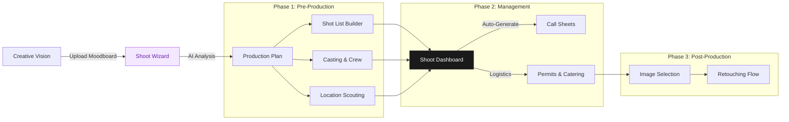

# Shoot Wizard & Production System Implementation Plan

## 📊 Progress Tracker
**Phase:** 2 - Production Planning System
**Overall Status:** 100% Complete

| Module | Status | Progress |
| :--- | :---: | :--- |
| **Infrastructure** | ✅ Done | 100% |
| **Concept Wizard (Steps 1-3)** | ✅ Done | 100% |
| **Logistics & Talent (Steps 4-6)** | ✅ Done | 100% |
| **AI Integration** | ✅ Done | 100% |
| **Production Dashboard** | ✅ Done | 100% |
| **Shot List Builder** | ✅ Done | 100% |

---

## 🗺️ Architecture Workflow

---

## 📋 Feature Page Task Matrix

| Component | Priority | Status | Type | Description |
| :--- | :---: | :---: | :---: | :--- |
| **ShootWizard.tsx** | P0 | ✅ | UI | Main multi-step wizard shell with navigation & progress bar |
| **ShootWizardContext** | P0 | ✅ | Logic | Global state management for booking flow |
| **ShootTypeStep** | P1 | ✅ | UI | Step 1: Card selection for shoot types |
| **ShootDetailsStep** | P1 | ✅ | UI | Step 2: Logistics inputs (Date, Location, Duration) |
| **CreativeStep** | P1 | ✅ | UI/AI | Step 3: Moodboard upload + AI Vision Analysis display |
| **TalentStep** | P2 | ✅ | UI | Step 4: Model & Stylist selection cards |
| **DeliverablesStep** | P2 | ✅ | UI/AI | Step 5: Format selection + AI Shot List Preview |
| **AddOnsStep** | P2 | ✅ | UI | Step 6: Retouching & usage rights configuration |
| **ReviewStep** | P1 | ✅ | UI | Step 7: Pricing breakdown & confirmation |
| **ShotListBoard** | P2 | ✅ | UI | Kanban-style drag-and-drop shot organizer (In Dashboard) |
| **CallSheet** | P3 | 🟡 | PDF | Intelligent schedule generator (Next Phase) |

---

## 🤖 AI Integration Details (Implemented)

### Shot List Generation
- **Model:** Gemini 3 Pro Preview
- **Features:**
  - **Thinking Config:** Uses reasoning budget to plan cohesive editorial stories.
  - **Structured Outputs:** Returns strict JSON schema for seamless UI rendering.
  - **Logic:** Balances "Safe/Commercial" shots with "Editorial/Creative" angles.

### Moodboard Analysis
- **Model:** Gemini 3 Pro Preview (Vision)
- **Features:**
  - **Vision Analysis:** Extracts color palettes and lighting styles.
  - **Grounding:** Uses Google Search to verify real-world brand references and current trends.
  - **Structured Outputs:** Returns typed aesthetic profile.

---

## ✅ Success Criteria

1. **Seamless Flow**: A user can navigate from Step 1 to Step 7 without state loss or layout jank.
2. **Visual Impact**: The "Creative Direction" step feels immersive (large images, masonry layout) rather than just a file uploader.
3. **AI Utility**: The AI features provide *plausible, helpful* data (e.g., extracting "Warm Lighting" from a sunset photo) rather than generic text.
4. **Financial Clarity**: The pricing calculator updates instantly as add-ons are toggled.
5. **Mobile Readiness**: The dashboard works on an iPad (standard tool for producers on set).
