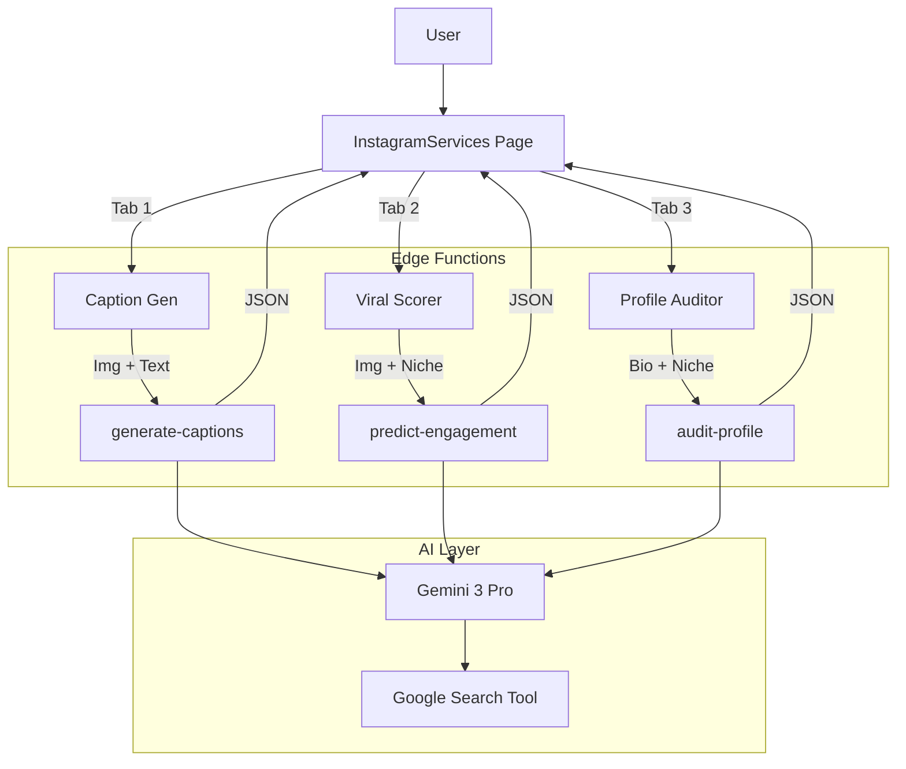

# 🚀 Instagram AI Features & Production Plan

## 1. Executive Summary & Status
**Current Status:** 🟢 **Production Ready (v1.1)**
The FashionOS Instagram Suite is now fully operational with three core AI tools: **Caption Generator**, **Viral Scorer**, and **Profile Auditor**.

**Completed Features:**
1.  **Vision AI:** Uploads are analyzed for context, color, and mood using `gemini-3-pro-preview`.
2.  **Trend Awareness:** Search Grounding integrated into all tools for real-time relevance.
3.  **Persistence:** LocalStorage-based history for captions.
4.  **Viral Scorer:** Predictive analysis of content performance before posting.
5.  **Profile Audit:** Strategic critique of bio and niche alignment.

**Gap Analysis for Future (v1.2):**
1.  **Backend Rate Limiting:** Required before scaling to thousands of users.
2.  **User Profiles:** Sync history to Supabase DB instead of LocalStorage.

---

## 2. Gemini 3 Pro Integration Matrix

| Feature | Tool / Capability | Use Case in FashionOS | Status |
| :--- | :--- | :--- | :--- |
| **Text Generation** | `generateContent` | Caption Writing | ✅ Live |
| **Vision Analysis** | `gemini-3-pro-preview` | Image Context Extraction & Scoring | ✅ Live |
| **Grounding** | `tools: [{googleSearch: {}}]` | Trending Hashtags & Audit | ✅ Live |
| **Gemini Thinking** | `thinkingConfig` | Content Strategy Reasoning | ✅ Live |
| **Structured Outputs** | `JSON parsing` | UI Integration | ✅ Live |

---

## 3. Architecture Workflow



---

## 4. Implementation Roadmap

### Phase 1: Core (Completed ✅)
- [x] UI Component (`InstagramCaptionGenerator`)
- [x] Multimodal Input (Image + Text)
- [x] Edge Function Setup
- [x] Structured JSON Output

### Phase 2: Intelligence Upgrade (Completed ✅)
- [x] **Search Grounding:** Integrated in backend to fetch live trends.
- [x] **Thinking Exposure:** UI displays the "Why this works" reasoning block.
- [x] **History Tab:** LocalStorage implementation for session persistence.

### Phase 3: Advanced Tools (Completed ✅)
- [x] **Profile Auditor:** Input URL/Bio -> AI Critique -> Report Card UI.
- [x] **Viral Scorer:** Image Analysis -> Trend Comparison -> Performance Score (0-100).

---

## 5. Supabase Schema (Data Layer - Planned)

To make this production-ready for v2.0 (User Accounts), apply this SQL:

```sql
-- Enable Vector extension for future semantic search of history
create extension if not exists vector;

-- Generated Content History
create table public.content_history (
  id uuid default gen_random_uuid() primary key,
  user_id uuid references auth.users not null,
  tool_type text, -- 'caption', 'audit', 'predict'
  input_data jsonb,
  output_data jsonb,
  created_at timestamptz default now()
);
```

---

## 6. Success Criteria Checklist

| Category | Metric | Goal | Status |
| :--- | :--- | :--- | :--- |
| **Performance** | API Latency | < 8 seconds for vision analysis. | ✅ |
| **Quality** | Utility | Tools provide specific, actionable advice (not generic). | ✅ |
| **Reliability** | Error Rate | < 1% of requests fail due to timeouts or API errors. | ✅ |
| **Visuals** | UI Polish | Premium "Dark Mode" aesthetic consistent across tools. | ✅ |
