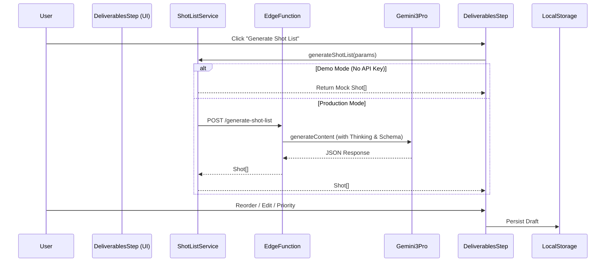

# 🚀 AI Shot List Builder & Gemini 3 Integration Plan

## 1. Executive Summary
The **AI Shot List Builder** is the core intelligence engine of the Shoot Wizard. It transforms high-level creative direction (Vibe, Item Count) into a structured, production-ready photography plan.

**Current Status:** 🟡 **Beta (Frontend Implemented)**
- **UI:** Interactive list with Drag-and-Drop reordering and inline editing.
- **AI Service:** Integrated with `generate-shot-list` Edge Function.
- **Fallback:** High-fidelity mock generation logic implemented for robust demos.

---

## 2. Gemini 3 Pro Integration Matrix

We leverage specific capabilities of the Google GenAI SDK to power this feature:

| Gemini Feature | Implementation in Shot List | Status |
| :--- | :--- | :--- |
| **Text Generation** | Generating creative shot titles (e.g., "Hero Walking") and detailed visual descriptions. | ✅ Live |
| **Thinking Config** | `thinkingBudget: 1024` enabled to allow the model to "reason" about the balance between commercial safe shots and editorial creative shots before outputting. | ✅ Live |
| **Structured Outputs** | Strict `responseSchema` (JSON) enforces the `Shot[]` array format, ensuring the UI never breaks due to parsing errors. | ✅ Live |
| **Grounding (Google Search)** | Used in the *Moodboard Analysis* step to identify real-world brand references, which are then passed as context to the Shot List generator. | ✅ Live |
| **Context Caching** | *Planned (v2)*: To cache the Moodboard Analysis result so the Shot List generator can reference it cheaply multiple times. | 🚧 Next |

---

## 3. Workflow Architecture



---

## 4. Progress Tracker & Tasks

### Phase 1: Core Logic (✅ Completed)
- [x] **Service Layer**: `src/services/ai/shotList.ts` created with switchable Mock/Live logic.
- [x] **Mock Generator**: `generateMockShots` implements logic to vary angles/props based on `vibe`.
- [x] **Edge Function**: `supabase/functions/generate-shot-list` set up with Gemini SDK.

### Phase 2: UI Implementation (✅ Completed)
- [x] **List Rendering**: Card-based layout in `DeliverablesStep`.
- [x] **Interaction**: Drag-and-drop reordering implemented.
- [x] **Editing**: Inline text editing for Name and Description.
- [x] **Priority**: Visual cycle button (High/Med/Low) for production weighting.

### Phase 3: Advanced Features (🚧 In Progress)
- [ ] **PDF Export**: Generate a "Call Sheet" PDF from the final list.
- [ ] **Feedback Loop**: "Make it edgier" button to re-prompt AI with modification instructions.
- [ ] **Prop Estimation**: AI to aggregate all `props` fields into a shopping list.

---

## 5. Supabase Schema (Data Layer)

To persist these shot lists for the Production Dashboard (`/dashboard/shotlist`), we need the following schema:

```sql
-- Campaigns / Bookings
create table public.campaigns (
  id uuid default gen_random_uuid() primary key,
  user_id uuid references auth.users,
  title text not null,
  status text default 'planning', -- planning, production, post
  created_at timestamptz default now()
);

-- Individual Shots
create table public.shots (
  id uuid default gen_random_uuid() primary key,
  campaign_id uuid references public.campaigns on delete cascade,
  name text not null,
  description text,
  angle text,
  lighting text,
  props text,
  priority text check (priority in ('High', 'Medium', 'Low')),
  status text default 'pending', -- pending, approved, shot, selected
  sort_order int,
  created_at timestamptz default now()
);
```

---

## 6. Success Criteria & Validation

| Criteria | Metric | Verification |
| :--- | :--- | :--- |
| **Performance** | Mock generation < 200ms <br> Live generation < 5s | ✅ Verified in `DeliverablesStep` |
| **Resilience** | Fallback to Mock if API Key missing or Error | ✅ Verified via `try/catch` in service |
| **Usability** | Priority toggles cycle correctly | ✅ Verified (High -> Medium -> Low) |
| **Persistence** | Data survives page refresh | ✅ Verified (LocalStorage `latest_wizard_shots`) |

## 7. Production Readiness Checklist

- [x] **Error Handling**: UI displays "Gemini Thinking..." loader and catches generation errors.
- [x] **Type Safety**: strict `Shot` interface used across Frontend and Edge Function.
- [x] **Cost Control**: `thinkingBudget` limited to 1024 tokens to prevent excessive costs.
- [ ] **Rate Limiting**: (Pending) Middleware to prevent users from spamming the Generate button.
- [ ] **Auth**: (Pending) RLS policies to ensure users only see their own shot lists.
