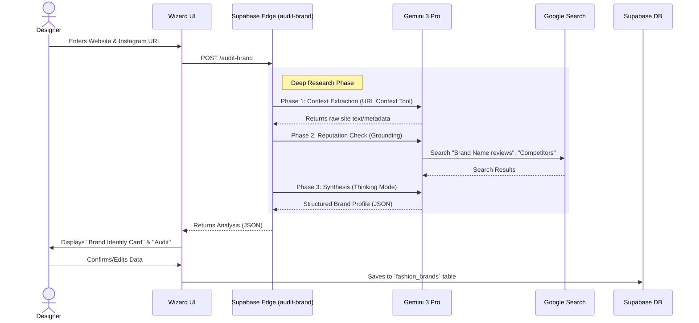

# FashionOS Designer Wizard (Brand Onboarding)

**Version:** 1.0
**Status:** Specification & Architecture
**AI Model:** Gemini 3 Pro (Deep Research & URL Context)

---

## 📊 1. Progress Tracker

| Module | Status | Priority | AI Integration |
| :--- | :---: | :---: | :--- |
| **Strategy & Flow** | 🟢 **Done** | P0 | N/A |
| **UI: Input Screen (URLs)** | 🟢 **Done** | P1 | N/A |
| **Edge Function: `audit-brand`** | 🟢 **Done** | P0 | **High** (Deep Research + URL Context) |
| **UI: Analysis Dashboard** | 🟢 **Done** | P1 | N/A |
| **Database: Brand Schema** | 🟡 **Partial** | P1 | N/A |
| **Integration: Shopify/Amazon** | 🔴 **Missing** | P2 | Medium |

### ✅ Success Criteria
1.  **Zero-Entry Onboarding:** Designer provides *only* a website URL and Instagram handle; AI fills 90% of the profile (Bio, Category, Price Point, Aesthetics).
2.  **Deep Research:** AI correctly identifies the brand's market positioning (e.g., "Sustainable Luxury" vs "Fast Fashion") by cross-referencing their site with external reviews/press via Google Search.
3.  **Value First:** The wizard concludes by giving the designer a "Free Audit" (e.g., "Your Instagram engagement is 20% lower than competitors in the 'Boho Chic' niche").

---

## 🗺️ 2. Workflows & Diagrams

### User Journey: The "Magic" Setup



---

## 3. Screens & Actions

### Screen 1: The Input (Digital Twin Setup)
*   **Visuals:** Minimalist, high-end form.
*   **Inputs:**
    *   Brand Name
    *   Website URL
    *   Instagram Handle
    *   (Optional) Lookbook PDF Upload
*   **Action:** "Analyze My Brand" (Triggers AI).

### Screen 2: The Reveal (AI Analysis Summary)
*   **Behavior:** A "scanning" animation displays while Gemini processes (reading site, checking press).
*   **Content Displayed (Auto-Filled):**
    *   **Category:** e.g., "Contemporary Womenswear"
    *   **Aesthetic Keywords:** e.g., "Minimalist, Scandi, Organic"
    *   **Price Positioning:** "$$$ (Luxury)"
    *   **Target Audience:** "Millennial Women, 25-40, Urban"
*   **User Action:** "Looks Correct" or "Edit".

### Screen 3: The Strategic Audit (Value Add)
*   **Purpose:** Prove ROI immediately.
*   **AI Generated Insights:**
    *   "**Visual Consistency:** Your website photography is 'High Key' but your Instagram is 'Dark/Moody'. Recommendation: Align visual tonality."
    *   "**Market Gap:** We found high search volume for 'Sustainable Silk' in your region, which fits your catalog."
*   **Call to Action:** "Book a Campaign to fix visuals" or "Find Stylists matching this vibe."

---

## 4. AI Agents & Automation Logic

### Agent: `BrandArchitect` (Gemini 3 Pro)
This agent runs on the backend to construct the brand's profile.

**Capabilities Used:**
1.  **URL Context Tool:** To scrape the brand's "About Us" and "Shop" pages to understand the product line.
2.  **Google Search Grounding:** To find what *others* say about the brand (Vogue mentions, Trustpilot reviews) to determine "Prestige Level."
3.  **Thinking Config:** To reason about the brand's archetype.
    *   *Reasoning Trace:* "Prices are >$500. Materials are Silk/Wool. Website font is Serif. -> Conclusion: 'Luxury' positioning."

**Prompt Strategy (Deep Research):**
> "You are a Fashion Brand Strategist.
> 1.  **Read** the content from [URL]. Extract the mission statement and product categories.
> 2.  **Search** Google for '[Brand Name] fashion reviews' and '[Brand Name] competitors'.
> 3.  **Analyze** the Instagram profile [URL] for visual themes.
> 4.  **Synthesize** a profile:
>     *   Determine the 'Vibe' (e.g., 'Y2K', 'Old Money').
>     *   Identify 3 direct competitors.
>     *   Rate their current 'Content Health' (0-100) based on visual consistency between Site and Social."

---

## 5. Software Development Lifecycle (SDLC)

### Database Schema (Supabase)
Updates to `fashion_brands` table to support AI insights.

```sql
alter table fashion_brands 
add column if not exists market_segment text, -- 'luxury', 'mass', 'contemporary'
add column if not exists aesthetic_keywords text[], -- ['minimalist', 'boho']
add column if not exists primary_competitors text[],
add column if not exists brand_audit_score integer, -- 0-100
add column if not exists audit_report jsonb; -- Full AI analysis
```

### Backend (Edge Function: `audit-brand`)

```typescript
// supabase/functions/audit-brand/index.ts
import { serve } from "https://deno.land/std@0.168.0/http/server.ts";
import { GoogleGenAI } from "https://esm.sh/@google/genai@0.5.0";

const ai = new GoogleGenAI({ apiKey: Deno.env.get('API_KEY') });

serve(async (req) => {
  const { websiteUrl, instagramUrl } = await req.json();

  // 1. Research Phase
  const response = await ai.models.generateContent({
    model: 'gemini-3-pro-preview',
    contents: `Conduct a deep brand audit for ${websiteUrl}.`,
    config: {
      tools: [{ googleSearch: {} }, { codeExecution: {} }], // Code execution to parse complex HTML if needed
      responseSchema: {
        type: 'OBJECT',
        properties: {
          brand_profile: { type: 'OBJECT' }, // Vibe, Category, Price
          audit_score: { type: 'INTEGER' },
          strategic_advice: { type: 'ARRAY' }
        }
      }
    }
  });

  return new Response(JSON.stringify(response));
});
```

### Frontend Wiring
1.  Create `src/components/wizards/DesignerWizard.tsx`.
2.  Use `useEventSource` or polling for the Analysis step (as Deep Research can take 10-20 seconds).
3.  Display results in a "Report Card" component.

---

## 6. Production Ready Checklist

- [x] **Edge Function:** Deploy `audit-brand` with Gemini 3 Pro API key.
- [ ] **Rate Limiting:** Ensure users can't spam the "Audit" button (expensive operation).
- [x] **Fallback Data:** If website scraping fails, allow manual entry of brand description.
- [x] **Mobile Responsive:** The Wizard must work on mobile (Designers are often on the go).
- [x] **Validation:** Ensure `websiteUrl` is valid before sending to AI.
