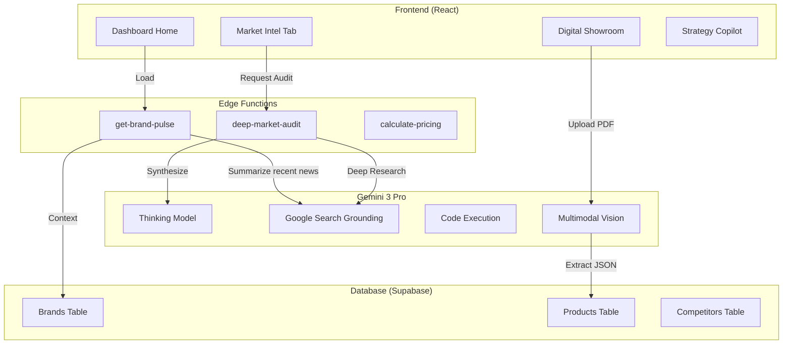

# FashionOS Designer Dashboard (Brand Command Center)

**Version:** 1.0
**Status:** Architecture & Strategy
**AI Model:** Gemini 3 Pro (Thinking, Code Execution, Deep Research)

---

## 📊 1. Progress Tracker

| Module | Status | Priority | AI Integration |
| :--- | :---: | :---: | :--- |
| **Strategy & IA** | 🟢 **Done** | P0 | N/A |
| **Dashboard Layout** | 🟡 **Partial** | P1 | N/A |
| **"Brand Pulse" (AI Overview)** | 🔴 **Missing** | P1 | **High** (Summarization + Search) |
| **Digital Showroom (CMS)** | 🔴 **Missing** | P0 | **High** (Vision + Structured Output) |
| **Market Intelligence** | 🔴 **Missing** | P2 | **Extreme** (Deep Research + Thinking) |
| **Pricing Strategy Tool** | 🔴 **Missing** | P2 | **High** (Code Execution) |

### ✅ Success Criteria
1.  **Zero-Admin Cataloging:** Designer uploads a PDF Line Sheet; Gemini parses it into structured database rows (Products, SKUs, Prices) with 99% accuracy.
2.  **Strategic Insight:** The dashboard doesn't just show charts; it explains *why* sales are down using **Thinking Mode** (e.g., "Competitor X launched a similar coat at a lower price point").
3.  **Actionable Intelligence:** Users can execute complex tasks (e.g., "Email all buyers who bought the silk blouse") via natural language.

---

## 🗺️ 2. System Architecture & Workflows

### Data & Logic Flow



---

## 📱 3. Dashboard Pages & Features

### A) Home: The "Brand Pulse"
**Concept:** A morning briefing for the designer.
*   **Content:**
    *   **Notification Stream:** New wholesale orders, production updates.
    *   **AI Insight Card:** "Your 'Cerulean Sweater' is trending. Search volume for 'Cerulean' is up 200% this week. Suggestion: Move it to the homepage."
    *   **Capabilities:** Uses **Interactions API** for low-latency updates.

### B) Digital Showroom (Inventory)
**Concept:** The source of truth for products.
*   **Feature: "Magic Import"**
    *   **User Action:** Drag & Drop a raw Lookbook PDF or a folder of images.
    *   **AI Agent (Vision + Structured Output):**
        1.  Identifies garments in images.
        2.  Extracts fabric composition from PDF text.
        3.  Suggests tags (e.g., "Sustainable", "Evening-wear").
        4.  Outputs strict JSON for Supabase.

### C) Market Intelligence (Deep Research)
**Concept:** An always-on consultant monitoring the industry.
*   **Feature: "Competitor Watch"**
    *   **User Input:** "Who is pricing silk dresses aggressively right now?"
    *   **AI Agent (Deep Research):**
        1.  **Grounding:** Searches competitor sites and luxury marketplaces (Net-a-Porter, Farfetch).
        2.  **Code Execution:** Scrapes pricing data and calculates averages.
        3.  **Output:** A comparison matrix and a recommended price range for the user's brand.

### D) Production & Logistics
**Concept:** Manage the physical creation of goods.
*   **Feature: "Costing Calculator"**
    *   **User Input:** "Fabric cost is $12/yard, labor $40. What should be my Wholesale and Retail price to maintain a 65% margin?"
    *   **AI Agent (Code Execution):** Writes and runs a Python script to calculate reliable pricing tiers (Landed Cost -> Wholesale -> RRP) including duty/shipping estimates.

---

## 🧠 4. Gemini 3 Pro "Super Prompts" & Logic

### Agent: `MarketStrategist`
**Trigger:** User clicks "Analyze Competitors" on the Market Intelligence tab.
**Tools:** `Google Search`, `Thinking Config`, `URL Context`.

**Prompt Structure:**
```text
ROLE: You are a Senior Fashion Buyer and Data Analyst.

TASK: Conduct a deep market audit for [Brand Name]'s upcoming "Summer Linen" collection.

STEPS:
1.  **Deep Research:** Search for "Summer 2025 Linen Trends" and "Luxury Linen Competitors".
2.  **Competitor Analysis:** Identify 3 direct competitors. Use URL Context to visit their "New Arrivals" pages.
3.  **Thinking Mode:** Analyze their pricing strategy vs. [Brand Name]'s target price ($300).
    *   *Trace:* Competitor A is $250 but cotton blend. Competitor B is $450 pure linen.
    *   *Reasoning:* [Brand Name] is positioned correctly as "Accessible Luxury".
4.  **Output:** Generate a SWOT analysis JSON.
```

### Agent: `VisualMerchandiser`
**Trigger:** User uploads a photo of a physical rack of clothes.
**Tools:** `Vision`, `Structured Outputs`.

**Prompt Structure:**
```text
Analyze this image of a clothing rack.
1.  Identify every garment visible.
2.  Group them by color story.
3.  Suggest a "Drop Name" based on the visual theme (e.g., "Desert Dusk").
4.  Return JSON: { items: [], suggested_theme: "", color_palette: [] }
```

---

## 🛠️ 5. Database Schema (Supabase)

To support these features, we extend the schema:

```sql
-- Track brands tracked by the AI for comparison
create table brand_competitors (
  id uuid default gen_random_uuid() primary key,
  brand_id uuid references organizations(id),
  competitor_name text,
  competitor_url text,
  price_positioning text -- 'lower', 'similar', 'higher'
);

-- Store deep research reports
create table market_reports (
  id uuid default gen_random_uuid() primary key,
  brand_id uuid references organizations(id),
  report_type text, -- 'pricing', 'trend', 'audit'
  ai_summary text,
  structured_data jsonb, -- The full JSON output from Gemini
  created_at timestamptz default now()
);

-- Store line sheet uploads
create table line_sheets (
  id uuid default gen_random_uuid() primary key,
  brand_id uuid references organizations(id),
  file_url text,
  processing_status text, -- 'uploading', 'analyzing', 'complete'
  extracted_data jsonb -- The AI-parsed product list before approval
);
```

---

## ✅ 6. Production Ready Checklist

### Security
- [ ] **RLS Policies:** Ensure `market_reports` are only visible to the `brand_id` owner.
- [ ] **API Keys:** Gemini Key stored in Supabase Vault (Env variables), never exposed to client.

### Performance
- [ ] **Background Jobs:** "Deep Research" can take 30+ seconds. Use Supabase Edge Functions with `background` capability or a queue system so the UI doesn't hang.
- [ ] **Caching:** Cache Google Search results in `market_reports` to avoid burning tokens on repeated queries.

### UX
- [ ] **Streaming:** Use `Interactions API` or streaming responses for the "Strategy Copilot" chat to ensure it feels instant.
- [ ] **Optimistic UI:** Show "Processing..." skeletons while the Vision model parses line sheets.

---

## 🚀 7. Implementation Plan

1.  **Frontend:** Build the Shell (`layouts/DashboardLayout.tsx` update) and Empty States for the 4 core pages.
2.  **Backend:** Create `supabase/functions/deep-market-audit` using the prompt above.
3.  **Integration:** Wire the "Analyze" button in React to call the Edge Function and poll for results.
4.  **Polish:** Add Mermaid charts (using a React charting library) to visualize the data returned by the AI.
