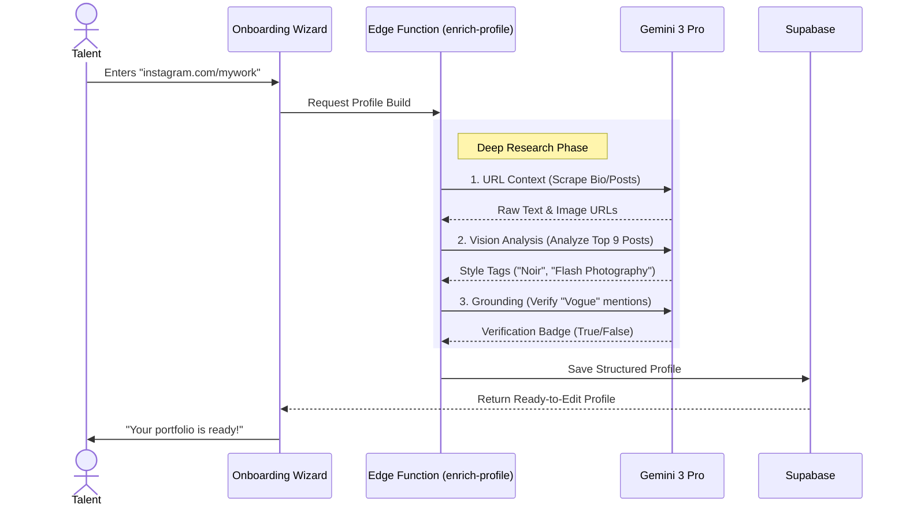

# FashionOS Directory (The Network) Architecture

**Version:** 2.0 (Premium & AI-Enhanced)
**Status:** Design & Strategy
**AI Model:** Gemini 3 Pro (Vision, Deep Research, Vector Search)

---

## 📊 1. Progress Tracker

| Module | Status | Priority | AI Integration |
| :--- | :---: | :---: | :--- |
| **Strategy & UX** | 🟢 **Done** | P0 | N/A |
| **Database Schema** | 🟡 **Partial** | P1 | N/A |
| **Talent Onboarding Flow** | 🔴 **Missing** | P1 | **High** (Auto-fill via URL Context) |
| **Portfolio Analysis** | 🔴 **Missing** | P2 | **Extreme** (Vision + Style Tagging) |
| **Semantic Search** | 🔴 **Missing** | P2 | **High** (Vector Embeddings) |
| **Public Profile Page** | 🟡 **Partial** | P1 | N/A |

### ✅ Success Criteria
1.  **Visual Discovery:** Users search by "Vibe" (e.g., "Dark Moody Avant-Garde"), not just job title, using **Multimodal Embeddings**.
2.  **Zero-Friction Profile:** Talent drops an Instagram link; Gemini builds a full portfolio site in < 30 seconds.
3.  **Verified Trust:** AI cross-references claimed credits (e.g., "Shot for Vogue") against the web using **Deep Research**.

---

## 💎 2. Premium UX & Design Philosophy

The Directory is not a phonebook; it is a **Curated Gallery**.

### Visual Language
*   **Layout:** "Masonry First." Moving away from rows/tables. The interface should feel like browsing a high-end magazine or Pinterest board.
*   **Typography:** Large, editorial Serif headers for names. Minimalist Sans-Serif for metadata.
*   **Interaction:**
    *   *Hover:* Smooth scaling of portfolio thumbnails.
    *   *Quick View:* "Peeking" at a profile without leaving the search grid.
    *   *Video:* Autoplay minimal GIFs/Videos on hover for Videographers.

### Filter Logic (The "Smart Sieve")
Instead of just checkboxes, we use **Natural Language Filtering**:
*   *Input:* "Find me a photographer in Paris who shoots film and costs under €2k."
*   *UI Filters:*
    *   **Role:** (Photographer, Stylist, Model, MUA, Set Design)
    *   **Aesthetic:** (Minimalist, Grunge, High-Glamour, Streetwear) - *AI Generated Tags*
    *   **Medium:** (Digital, 35mm Film, Medium Format, Video)
    *   **Location:** (City radius)
    *   **Availability:** (Live calendar integration)

---

## 🗺️ 3. Architecture & Data Flow

### AI-Powered Onboarding Flow



---

## 📱 4. Profile Page Features

### The "Digital Comp Card"
The profile page serves as the single source of truth for booking.

1.  **Hero Section:** Full-width cover image (or video reel).
    *   *Overlays:* Verified Badge, "Available Next Week" Indicator.
2.  **Portfolio Grid:**
    *   Smart sorting: AI puts the "best" or "most relevant" images at the top based on current trends.
3.  **Credits List:**
    *   "As Seen In:" Logos of brands/magazines (Verified by AI).
4.  **The "Book Me" Button:**
    *   Directly opens the **Shoot Wizard**, pre-filling this talent into the `TalentStep`.
5.  **Reviews:**
    *   Verified reviews from other FashionOS users (closed-loop reputation).

---

## 🧠 5. AI Agents & Automation Logic

### Agent: `TalentScout` (Gemini 3 Pro)
**Trigger:** User searches in the Directory.
**Capabilities:** `Vector Search`, `Thinking Config`.

**Logic:**
1.  User Query: "Photographer for a sustainable linen brand, beach vibes."
2.  **Thinking Mode:**
    *   *Concept:* "Beach vibes" = High Key lighting, Warm tones, Natural elements.
    *   *Match:* Looks for profiles with tags: `Natural Light`, `Organic`, `Travel`.
3.  **Vector Search:** Queries `pgvector` in Supabase for semantic image matches.
4.  **Output:** Returns ranked list of talent.

### Agent: `PortfolioCurator` (Gemini Vision)
**Trigger:** Talent uploads raw images.
**Capabilities:** `Vision`, `Structured Outputs`.

**Prompt Structure:**
> "Analyze this fashion editorial image.
> 1.  **Technical:** Identify Lighting (Softbox, Hard Flash, Natural), Camera Angle (Low, Dutch), and Color Palette (Hex).
> 2.  **Stylistic:** Assign 3 aesthetic tags (e.g., 'Y2K', 'Old Money', 'Cyberpunk').
> 3.  **Subject:** Identify garments (e.g., 'Trench Coat', 'Platform Boots').
> 4.  Output JSON for search indexing."

---

## 🛠️ 6. Backend Implementation Plan

### Database Updates (`stakeholders` table extension)

```sql
-- Enable Vector Search
create extension if not exists vector;

alter table stakeholders 
add column if not exists bio_embeddings vector(1536), -- For semantic search
add column if not exists portfolio_images jsonb[], -- [{url, tags, ai_score}]
add column if not exists verified_credits text[], -- ['Vogue', 'Nike']
add column if not exists aesthetic_tags text[], -- ['minimalist', 'film']
add column if not exists day_rate_min integer,
add column if not exists day_rate_max integer;

-- Function to match talent
create or replace function match_talent (
  query_embedding vector(1536),
  match_threshold float,
  match_count int
)
returns setof stakeholders
language plpgsql
as $$
begin
  return query
  select *
  from stakeholders
  where 1 - (bio_embeddings <=> query_embedding) > match_threshold
  order by bio_embeddings <=> query_embedding
  limit match_count;
end;
$$;
```

### Edge Function: `enrich-profile`

```typescript
// supabase/functions/enrich-profile/index.ts
import { serve } from "https://deno.land/std@0.168.0/http/server.ts";
import { GoogleGenAI } from "https://esm.sh/@google/genai@0.5.0";

const ai = new GoogleGenAI({ apiKey: Deno.env.get('API_KEY') });

serve(async (req) => {
  const { instagramUrl, role } = await req.json();

  // 1. Use Gemini to "browse" and extract context
  // Note: Real implementation would use a scraping API, 
  // but Gemini URL Context can read public bio/text info.
  
  const response = await ai.models.generateContent({
    model: 'gemini-3-pro-preview',
    contents: `Analyze the public profile of ${instagramUrl}. 
    Role: ${role}.
    Extract: Bio, Top 3 Aesthetic Keywords, and list of Brands mentioned in posts.`,
    config: {
      tools: [{ googleSearch: {} }], // Verify credibility
      responseSchema: {
        type: 'OBJECT',
        properties: {
          bio: { type: 'STRING' },
          tags: { type: 'ARRAY', items: { type: 'STRING' } },
          verified_brands: { type: 'ARRAY', items: { type: 'STRING' } }
        }
      }
    }
  });

  return new Response(JSON.stringify(response));
});
```

---

## 🚀 7. Step-by-Step Implementation

1.  **DB Upgrade:** Run the SQL migration to add vector columns and JSONB fields.
2.  **Backend:** Deploy `enrich-profile` Edge Function.
3.  **Frontend (Card):** Update `Directory.tsx` grid to support "Masonry" layout using a library like `react-masonry-css`.
4.  **Frontend (Profile):** Create `pages/Profile/[id].tsx` with the Hero Header and Portfolio Grid.
5.  **Search:** Implement the search bar to call `match_talent` RPC instead of simple text filtering.
