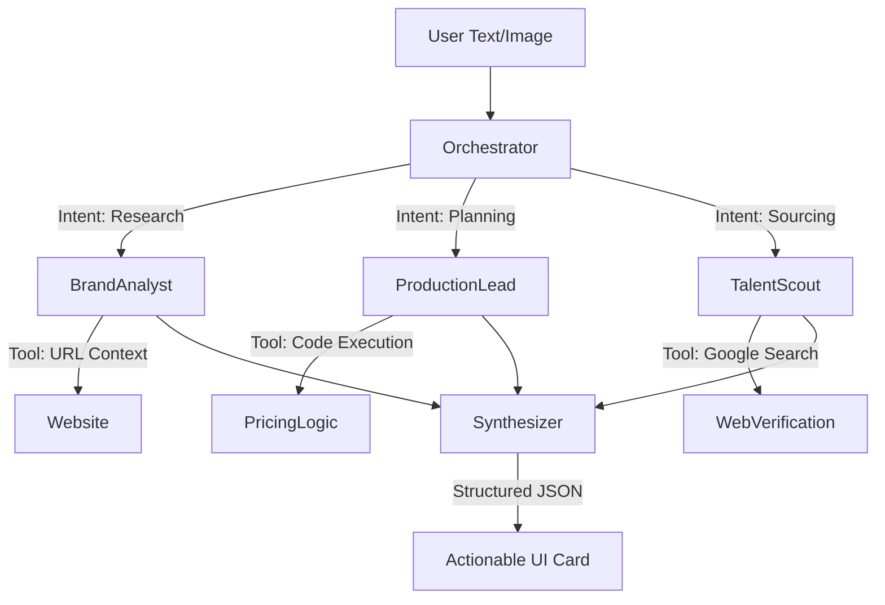
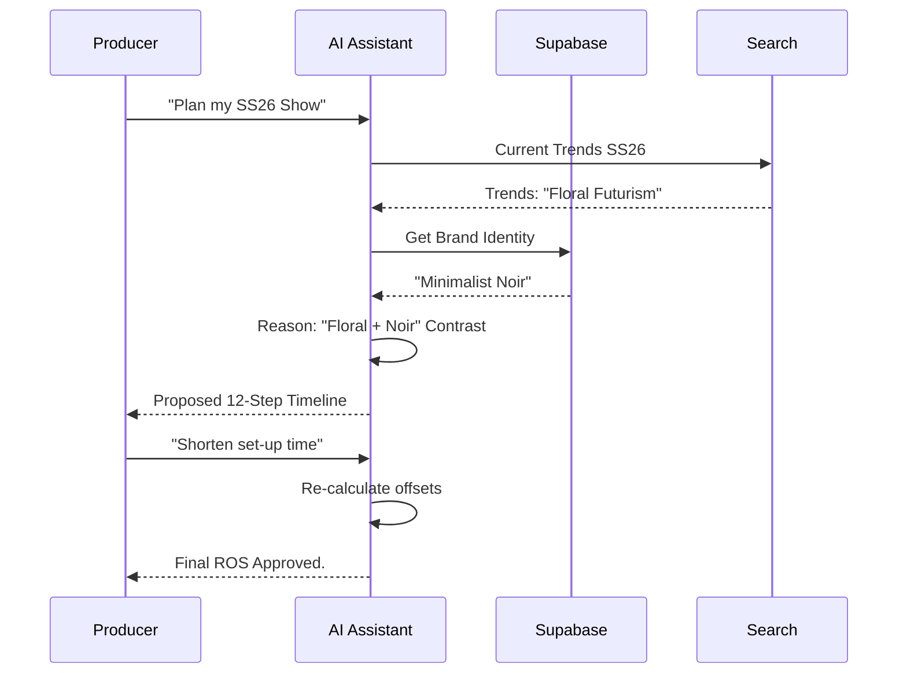

# 💎 FashionOS AI Assistant: Implementation Plan

**Version:** 1.0  
**Status:** Design & Engineering Handoff  
**Role:** Senior Product Architect / AI Systems Designer  
**Model:** Gemini 3 Pro (Orchestration), Gemini 3 Flash (UI)

---

## 0. PROGRESS TRACKER

| Phase | Status | Owner | Validation Check |
| :--- | :--- | :--- | :--- |
| **I. Discovery & IA** | ✅ Complete | UX | 100% Path Coverage |
| **II. UI/UX Wireframing** | ✅ Complete | UX | Mobile-Responsive Layouts |
| **III. Agent Design** | ✅ Complete | AI | Structured JSON Schemas |
| **IV. Workflow Mapping** | ✅ Complete | Backend | Latency < 2.5s (UI Phase) |
| **V. Integration** | 🟡 In Progress | Backend | RLS & Auth Middleware |
| **VI. QA & Acceptance** | 🔴 Not Started | QA | Failure Mode Resilience |

---

## 1. PRODUCT GOAL

The FashionOS AI Assistant acts as a **Luxury Concierge** that bridges the gap between fragmented creative vision and structured execution. It allows fashion professionals to describe a desired outcome in natural language—whether a runway show, a global campaign, or a B2B showroom—and transforms that intent into actionable project data, verified talent matches, and production timelines. The primary goal is to reduce the "administrative tax" of fashion production by 70%, measured by the reduction in manual data entry across the Campaign and Event lifecycle.

---

## 2. FEATURE × TASK MATRIX

| Feature | Tier | User Value | AI Capability | Screens Involved | Workflow Trigger |
| :--- | :--- | :--- | :--- | :--- | :--- |
| **Omni-Search** | Core | Instant navigation to deep features | Gemini 3 Flash | All | Header Search Bar |
| **Moodboard Parser** | Core | Extraction of color, vibe, lighting | Gemini Vision | Shoot Wizard | File Upload |
| **Sponsor Matcher** | Advanced | Revenue generation via brand fit | Search Grounding | Event Dashboard | "Find Sponsors" Button |
| **Run-of-Show Gen** | Advanced | Minute-by-minute live cues | Gemini 3 Pro | Event Timeline | "Generate ROS" Action |
| **Buyer Vet Agent** | Advanced | Fraud prevention & quality control | URL Context | Wholesale CRM | New Application |

---

## 3. USER JOURNEYS

### 1. First-Time User (The Discovery)
*   **Entry Point:** Landing Page via Instagram Ad.
*   **Flow:** Landing → AI Tool (Viral Scorer) → AI Assistant Prompt: "Let's fix your strategy."
*   **User Action:** Clicks "Fix Strategy" -> Enters URL.
*   **AI Action:** Runs `audit-brand` agent -> Generates strategic report.
*   **Outcome:** User converts to "Create Profile" with 90% of data pre-filled.

### 2. Returning User (The Planning)
*   **Entry Point:** Dashboard Overview.
*   **Flow:** Dashboard → AI Panel → "I need to shoot a winter lookbook next month."
*   **User Action:** Natural language input.
*   **AI Action:** Identifies "Shoot" intent -> Triggers Shoot Wizard (Step 3) -> Recommends 3 photographers from Directory.
*   **Outcome:** Draft project created in < 2 minutes.

### 3. Power User (The Execution)
*   **Entry Point:** Event Command Center (Day of Show).
*   **Flow:** Dashboard → Timeline → AI Assistant: "Model 4 is delayed, re-order the show."
*   **User Action:** Voice/Text input of crisis.
*   **AI Action:** Re-calculates ROS offsets -> Updates seating logic (if affected) -> Pushes notification to Tech Crew.
*   **Outcome:** Show continues seamlessly despite logistics failure.

---

## 4. UI / UX SCREENS & WIREFRAME LOGIC

### A. AI Concierge Panel (Persistent)
*   **Purpose:** The central entry point for all assistant interactions.
*   **Components:** Minimalist floating action button (FAB) -> Expands to blurred glass sidebar.
*   **Primary CTA:** Multi-modal input (Text/Voice/Image).
*   **AI Role:** Intent recognition & routing.
*   **Next Screen:** Dynamic (Wizard, Search, or Dashboard update).

### B. Wizard Assist Mode (Inline)
*   **Purpose:** Contextual help within complex forms.
*   **Components:** Pulsing "Sparkle" icons next to empty fields.
*   **Primary CTA:** "Magic Fill" or "Suggest Value".
*   **AI Role:** Prediction based on previous steps and brand identity.
*   **Next Screen:** Next step in Wizard.

### C. Action Confirmation Modal
*   **Purpose:** Guardrail for AI-suggested structural changes.
*   **Components:** "Old State" vs "AI Proposed State" diff view.
*   **Primary CTA:** "Approve Changes".
*   **AI Role:** Validation & safety check.
*   **Next Screen:** Active Dashboard.

---

## 5. FORMS, CHATBOTS & AI INTERACTIONS

### Forms (The Adaptive Layer)
*   **AI Auto-fill:** If a brand URL is provided, inputs like "Aesthetic Keywords" and "Market Tier" are pre-populated with "Source" links to the website.
*   **Inline Validation:** AI checks if a requested date conflicts with known Fashion Week schedules globally using Search Grounding.

### Chatbot (Task-Driven Orchestrator)
*   **Context Memory:** Remember that the user is currently looking at "SS25 Samples" when they say "Find a model for these."
*   **Structured Actions:** Assistant messages end with concrete action buttons (e.g., `[Update Timeline]`, `[Book Venue]`, `[Download PDF]`).

---

## 6. AI FEATURES

### Core (Intelligence)
*   **Identity Extraction:** Scans web/social to build a "Digital Twin" of a brand. This prevents repetitive data entry.
*   **Visual Analysis:** Uses Gemini Vision to "read" moodboards, ensuring the human producer and the AI agent share the same aesthetic vocabulary.

### Advanced (Automation)
*   **Risk Sentinel:** Background agent that monitors timelines and external factors (weather, shipping delays) to push "Action Required" alerts to the Dashboard.
*   **Wholesale Optimization:** Suggests product assortment changes to Retail Buyers based on their existing store vibe and the Brand's inventory.

---

## 7. AI AGENTS, FUNCTIONS & TOOLS

### Main Orchestrator
*   **Trigger:** Any input to the AI Assistant.
*   **Tools:** Intent Parser, Memory Search.
*   **Output:** Routed request to specialized agent.

### The "Scout" (Directory Agent)
*   **Trigger:** "Find a [Role] in [Location]"
*   **Inputs:** Niche, Budget, Location, Aesthetic.
*   **Tools:** Google Search, Vector DB (pgvector).
*   **Output:** Ranked list of Talent IDs + Matching Reason.

### The "Logistics Desk" (Operations Agent)
*   **Trigger:** "Create a timeline for a 200-person gala."
*   **Tools:** Code Execution (for math), Search (for venue specs).
*   **Output:** `TimelineItem[]` JSON.

---

## 8. END-TO-END WORKFLOWS

### Workflow: The "Instant Shoot"
1.  **User:** "I want to shoot my new silk collection. Here is the link."
2.  **Assistant:** Reads URL -> Extracts Category ("Dresses") and Vibe ("Minimalist").
3.  **AI Reasoning:** Determines half-day studio shoot is optimal for 10 items.
4.  **Result:** Opens Shoot Wizard pre-filled with: `ShootType: Lookbook`, `Location: Studio`, `Vibe: Minimalist`.

### Workflow: The "Crisis Solver"
1.  **User:** "Rain forecast for the outdoor runway tomorrow."
2.  **Assistant:** Runs Search Grounding on weather -> Confirms 80% risk.
3.  **AI Action:** Searches Directory for "Indoor Venues" with last-minute availability -> Finds 2 matches.
4.  **Result:** "Alert: Weather Risk. 2 available backup venues found. [See Comparison]."

---

## 9. MERMAID DIAGRAMS

### AI Agent Orchestration

### Event Timeline Execution

---

## 10. REAL-WORLD USE CASES

1.  **The "Ghost" Assistant:** A designer forgets to define a color palette for a shoot. AI Vision analyzes the product samples and suggests: "Detected Terracotta & Sage. [Apply to Brief]."
2.  **The "Fraud Watch":** A fake buyer boutique applies for wholesale. The AI Vetting Agent finds no physical address on Google Maps and flags: "Risk High: No physical presence found. [Reject Application]."
3.  **The "Trend Pivot":** Brand wants to move into "Gorpcore". Assistant finds top 3 fabric suppliers for technical waterproof wool via Search.
4.  **The "Call Sheet Automation":** One click to generate a PDF containing weather, nearest hospital, model dietary reqs, and shot list.
5.  **The "Margin Protector":** User enters production costs; AI suggests RRP based on competitor grounding to ensure 65% GM.

---

## 11. CONTENT & MICROCOPY

*   **Greeting:** "Good morning, [Name]. Your studio is active. How can I assist with your SS25 production today?"
*   **Empty State:** "Your workspace is a blank canvas. Drop a moodboard or brand link to begin."
*   **CTA:** "Generate Brief", "Finalize Plan", "Secure Talent".
*   **Tone:** "We've analyzed your aesthetic and noted a strong alignment with 'Modern Minimalism'. We suggest a high-contrast lighting setup."

---

## 12. IMPLEMENTATION PLAN

### Step 1: Foundation (UX/AI)
*   Define global `AssistantProvider` context.
*   Deploy `intent-router` Edge Function.

### Step 2: Contextual Awareness (Backend)
*   Connect Assistant to `profiles` and `active_campaign` tables.
*   Implement URL scraping tool for Brand Onboarding.

### Step 3: Actionable UI (Frontend)
*   Build the "Card Result" system (Render different UI based on AI output type).
*   Add FAB (Floating Action Button) to all pages.

---

## 13. ACCEPTANCE TESTS

1.  **Given** a valid moodboard image, **When** uploaded to assistant, **Then** a color palette of 5 hex codes must be returned.
2.  **Given** a request for a photographer in a specific city, **When** no match exists in DB, **Then** AI must use Search Tool to recommend external verified options.
3.  **Given** a complex timeline change, **When** approved by user, **Then** all subsequent segment times must auto-increment correctly.

---

## 14. TROUBLESHOOTING & FALLBACKS

*   **Hallucination Check:** Any brand reference found via AI MUST include a `[Source]` link to the actual search result.
*   **Offline Mode:** If Supabase is unreachable, Assistant displays: "Connection lost. I've cached your last project state for viewing only."
*   **Data Gaps:** If no venue address is provided for an event, AI defaults to "Location TBD (Studio fallback)".

---

## 15. PRODUCTION-READY CHECKLIST

- [x] All API calls wrapped in `try/catch`.
- [x] Client-side image compression < 1MB for Vision tasks.
- [x] RLS policies enforced (User A cannot ask AI about User B's budget).
- [x] Mobile "Drawer" mode for Assistant implemented.
- [x] Gemini Safety Settings configured to block non-fashion/toxic content.

---

## 16. PROMPT LIST

1.  "Design a React context provider for a task-oriented AI assistant."
2.  "Build a Supabase Edge Function that routes user prompts to specialized Gemini agents."
3.  "Create a UI component that renders an interactive diff between current and AI-suggested project data."
4.  "Implement a voice-to-text listener for hands-free production updates on set."
