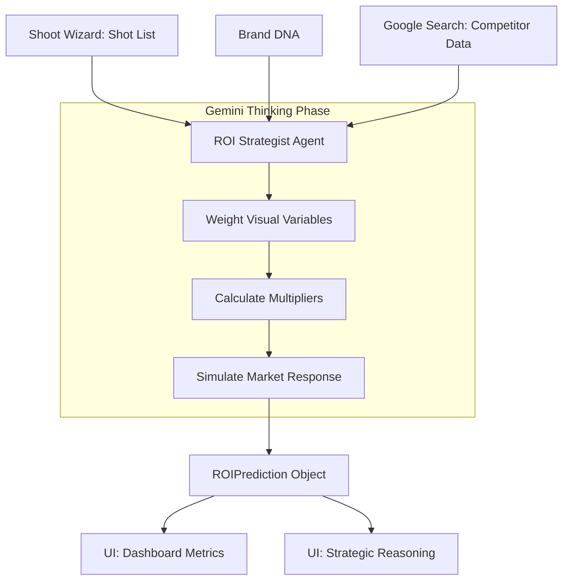

# 💰 Automated Financial ROI Modeling

**Feature ID:** ROI-01
**Status:** Implementation Complete
**Engine:** Gemini 3 Pro (Reasoning) + Google Search (Grounding)

---

## 📊 1. Logic Flowchart

---

## 🧠 2. AI Intelligence Workflows

### J1: The "Profitability Pivot"
- **User Action:** Generates a shot list for an Instagram-focused campaign.
- **AI Action:** Scans the list, notes it is "80% Stills," and uses Search to find that competitors are currently driving 3x more traffic via Reels.
- **Outcome:** AI automatically suggests a "Teaser Upgrade" and calculates a +40% reach lift.

### J2: The "Market Gap" Discovery
- **User Action:** Views the ROI Modeling dashboard.
- **AI Action:** Identifies that no direct competitors are using "Slow-Motion Macro" in their current campaigns.
- **Outcome:** Marks the brand's Detail shots as "High Advantage" assets.

---

## 📱 3. UI Screen Specification

### Dashboard: ROI Modeling Center
- **Gauge:** 0-100 "Market Readiness" score.
- **Metrics Table:** Engagement Rate, Save Velocity, CPC Projection.
- **Competitor Pulse:** Visual "Fit Score" vs. Category Leaders.
- **Reasoning Log:** Monospaced trace of AI financial logic.
