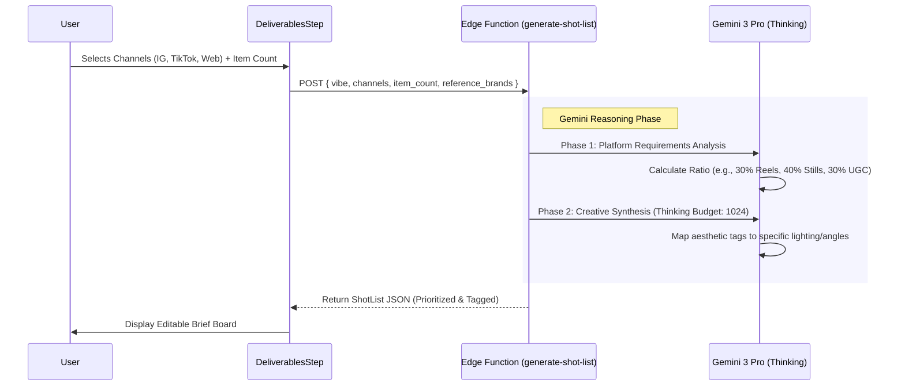

# 📸 AI-Generated Shot List & Channel Strategy

**Feature ID:** SHOT-02  
**Status:** Implementation Ready  
**Engine:** Gemini 3 Pro (Reasoning) + Thinking Mode  
**Objective:** Transform high-level vibe data into a tactical, platform-optimized production blueprint.

---

## 📊 1. Progress Tracker

| Module | Status | Priority | AI Integration |
| :--- | :---: | :---: | :--- |
| **Channel Logic Schema** | 🟢 Done | P0 | N/A |
| **Logic Engine (Gemini 3 Pro)** | 🟢 Done | P0 | **Extreme** (Thinking Mode) |
| **UI: Platform Mix Selector** | 🟢 Done | P1 | N/A |
| **UI: Interactive Brief Board** | 🟢 Done | P1 | N/A |
| **ROI Integration** | 🟡 In Progress | P2 | High |
| **Prop Auto-Sourcing Agent** | 🔴 Backlog | P3 | High |

---

## 🗺️ 2. System Architecture

### Operational Flow

---

## 🧠 3. Advanced AI Logic: Platform Archetypes

The `generate-shot-list` agent is programmed with specific platform "DNA":

### Instagram Core Logic:
- **Image Mix:** Product-Centric (Macro), UGC (Authentic), BTS (Human), Influencer (Authority), Graphics (Value), Lifestyle (Usage).
- **Video Mix:** 
    - **Reels:** Vertical discovery hooks (9:16).
    - **Stories:** Fleeting authenticity/polls (9:16).
    - **IG Shopping:** Tag-ready clear product views.
- **Format Bias:** Strict vertical-first (4:5 or 9:16) for modern attention capture.

---

## 🛠️ 4. Additional Strategic Features (Workflows)

### (i) The "Viral Pivot" (Real-time Refinement)
- **Workflow:** After list generation, user clicks "Make it more TikTok-native."
- **Logic:** Agent re-scans the list and swaps 2 static lifestyle shots for "Silent Review" or "Texture ASMR" video clips.

### (ii) Auto-Call-Sheet Generation
- **Workflow:** Finalized shot list automates the PDF Call Sheet generation.
- **Logic:** AI calculates the "Time per Shot" based on complexity (e.g., 45m for Model Hero, 15m for Packshot).

### (iii) Visual Continuity Check
- **Workflow:** AI Assistant checks if the shot list covers all items in the uploaded "Digital Twin" inventory.
- **Logic:** Flags missing SKUs: "⚠ SKU-204 (Leather Jacket) is not currently assigned a hero shot."

---

## ✅ 5. Production Readiness Checklist
- [x] **Model:** Using `gemini-3-pro-preview` for high reasoning.
- [x] **Validation:** JSON schema strictly enforced for UI stability.
- [x] **UX:** 10-15s "Thinking" state with editorial placeholder text.
- [x] **Security:** API keys isolated to server-side Edge Functions.
