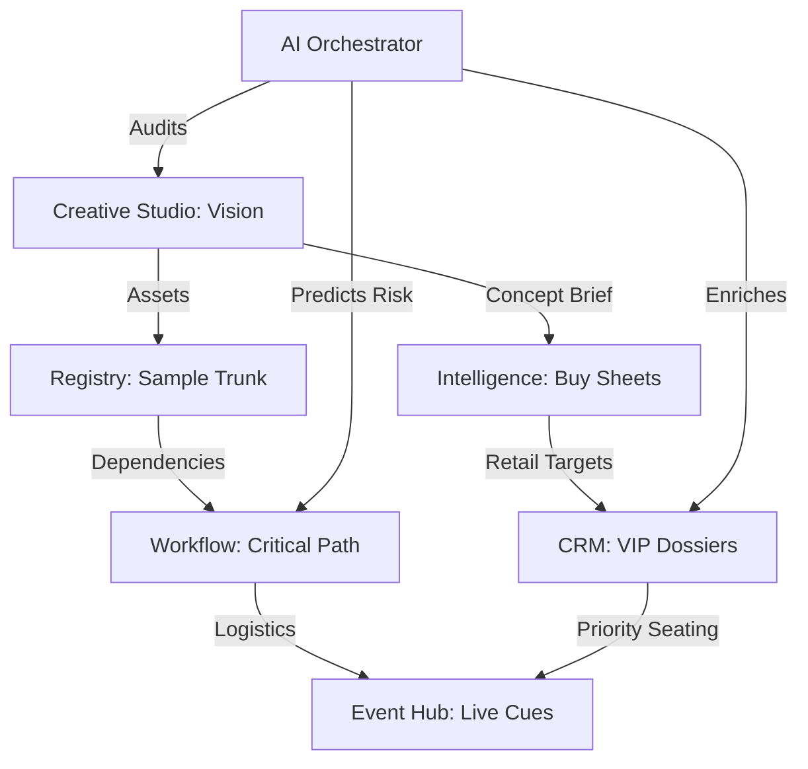

# 🏛️ fashionOS: Command & Control Architecture

**Feature ID:** DASH-01  
**Status:** Architecture Design  
**Focus:** Enterprise Luxury Resource Planning (ELRP)  
**Theme:** Editorial Precision / Calibrated UI  

---

## 📊 1. Progress Tracker

| Module | Status | Priority | AI Integration |
| :--- | :--- | :---: | :--- |
| **Telemetry Shell** | 🟡 In Progress | P0 | N/A |
| **Digital Twin Registry** | ⚪ Pending | P0 | Vision (Multimodal) |
| **Global Briefing (TTS)** | ⚪ Pending | P1 | Gemini Audio (Kore) |
| **Production Heatmap** | ⚪ Pending | P1 | Thinking (Anomaly Detection) |
| **Role-Based Views** | ⚪ Pending | P2 | N/A |

---

## 🗺️ 2. Integrated Data Flow



---

## 🧠 3. Mega-Prompt: The Daily Strategic Brief
**Model:** Gemini 3 Pro (Thinking) + Google Search  
**Context:** Morning briefing for the Creative Director.

> "Act as the Chief of Staff for a luxury fashion house. 
> 1. Consume the current system state: [CAMPAIGN_JSON], [TASK_LOGS], [MARKET_TRENDS].
> 2. Identify the top 3 'Friction Points' in the production lifecycle today.
> 3. Use **Google Search Grounding** to check if current logistical delays (ports, weather) impact the 'Registry' samples.
> 4. Synthesize a 300-word briefing.
> 5. Tone: Calm, authoritative, sophisticated.
> 6. Output strictly in JSON with 'briefing_text' and 'action_items' array."

---

## 📋 4. Schema: Dashboard Intelligence

```sql
-- Track global project health and AI-calculated risk
CREATE TABLE dashboard_telemetry (
  id uuid PRIMARY KEY DEFAULT gen_random_uuid(),
  campaign_id uuid REFERENCES campaigns(id),
  velocity_score integer CHECK (velocity_score BETWEEN 0 AND 100),
  risk_level text CHECK (risk_level IN ('optimal', 'warning', 'critical')),
  active_blockers text[],
  ai_strategy_suggestion text,
  last_updated timestamptz DEFAULT now()
);

-- Store daily AI generated briefings
CREATE TABLE daily_briefings (
  id uuid PRIMARY KEY DEFAULT gen_random_uuid(),
  user_id uuid REFERENCES auth.users(id),
  content text,
  sentiment_analysis jsonb, -- { morale: 'high', urgency: 'medium' }
  generated_at timestamptz DEFAULT now()
);
```

---

## ✅ 5. Production Readiness Checklist
- [ ] **T1:** Latency for global state hydration < 1.2s.
- [ ] **T2:** RLS policies prevent cross-brand data leakage.
- [ ] **T3:** All charts use responsive editorial styling (minimalist).
- [ ] **T4:** Fail-safe: Dashboard renders cached state if Edge Functions timeout.
