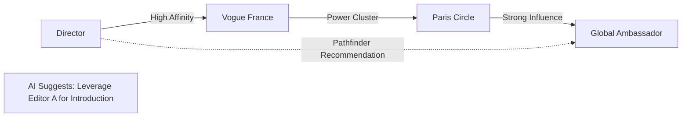

# 💎 fashionOS: Relationship Intelligence & Influence Mapping

**Feature ID:** CRM-01  
**Status:** Design Phase  
**Focus:** Turning Data into Relationship Capital  
**Model:** Gemini 3 Pro + Search Grounding  

---

## 📊 1. Progress Tracker

| Module | Status | Priority | AI Integration |
| :--- | :--- | :---: | :--- |
| **Dossier Engine** | 🟡 In Progress | P0 | Deep Research (Search) |
| **Influence Graphing** | ⚪ Pending | P1 | Graph Analysis (Thinking) |
| **Sentiment Guard** | ⚪ Pending | P2 | Pattern Recognition |
| **Gifting Bot** | ⚪ Pending | P2 | Matchmaking (Multimodal) |

---

## 🗺️ 2. Influence Graph: Power Clusters



---

## 🧠 3. Mega-Prompt: The Relationship Researcher
**Model:** Gemini 3 Pro + Search Grounding  
**Usage:** Enriching CRM data before a high-stakes meeting.

> "Act as an Elite PR Strategist. Conduct a deep-intel research task on [NAME].
> 1. Use **Search Grounding** to identify their 3 most recent brand collaborations or press mentions.
> 2. Analyze the 'Tone' of their public output (Minimalist vs Maximalist).
> 3. Identify potential 'Creative Conflicts' based on current brand affiliations.
> 4. Generate a 'Strategic Approach' dossier.
> 5. Output JSON: { name, influence_tier, recent_news: [], approach_guide: string }."

---

## 📋 4. Schema: Relationship Capital

```sql
-- Living dossiers for VIPs, Press, and Buyers
CREATE TABLE stakeholder_dossiers (
  id uuid PRIMARY KEY DEFAULT gen_random_uuid(),
  name text NOT NULL,
  role_type text CHECK (role_type IN ('VIP', 'Press', 'Buyer', 'Talent')),
  influence_score integer,
  aesthetic_dna text[], -- ['Minimalist', 'Noir']
  relationship_health integer DEFAULT 100,
  ai_research_data jsonb,
  last_enrichment_at timestamptz
);

-- Tracking interactions to power the Sentiment Guard
CREATE TABLE relationship_interactions (
  id uuid PRIMARY KEY DEFAULT gen_random_uuid(),
  stakeholder_id uuid REFERENCES stakeholder_dossiers(id),
  type text CHECK (type IN ('Email', 'Meeting', 'Show_Invite', 'Gifting')),
  sentiment_score float, -- -1 to 1
  context_summary text,
  created_at timestamptz DEFAULT now()
);
```

---

## ✅ 5. Production Readiness Checklist
- [ ] **T1:** Enrichment Dossier returns in < 6 seconds.
- [ ] **T2:** Influence Tiering logic calibrated to luxury standards.
- [ ] **T3:** Vector embeddings generated for aesthetic DNA matching.
- [ ] **T4:** GDPR/Privacy compliance for stored researcher data.
