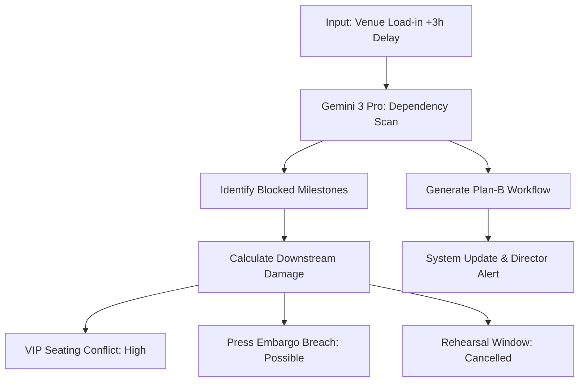

# 🌑 fashionOS: AI Task Orchestration & Risk Engineering

**Feature ID:** TASK-01  
**Status:** Implementation Blueprint  
**Focus:** Zero-Chaos "Show Day" Execution  
**Model:** Gemini 3 Pro (High Thinking Budget)  

---

## 📊 1. Progress Tracker

| Module | Status | Priority | AI Integration |
| :--- | :--- | :---: | :--- |
| **Brief-to-Workflow** | 🟢 Ready | P0 | Synthesis (Flash) |
| **Critical Path Analysis** | ⚪ Pending | P0 | Reasoning (Thinking) |
| **Cascade Simulator** | ⚪ Pending | P1 | Scenario Logic (Thinking) |
| **Visual Verification** | ⚪ Pending | P2 | Vision (Multimodal) |

---

## 🗺️ 2. Logic Flow: Dependency Cascade



---

## 🧠 3. Mega-Prompt: The Workflow Architect
**Model:** Gemini 3 Pro (Thinking Budget: 12000)  
**Usage:** Transforming a raw brief into a 150-task operational plan.

> "System Instruction: You are the Chief Production Officer for fashionOS.
> 1. Consume the project brief: [USER_INPUT].
> 2. Decompose into 4 critical phases: Concept, Sourcing, Production, Logistics.
> 3. For each phase, identify 3 'Load-Bearing' tasks with mandatory dependencies.
> 4. For each task, generate a technical sub-checklist (Lighting, Talent, Legal).
> 5. Use **Thinking Mode** to predict common points of failure for this event type.
> 6. Output strictly in JSON for system ingestion."

---

## 📋 4. Schema: Task Orchestration

```sql
-- Task registry with dependency graphing
CREATE TABLE production_tasks (
  id uuid PRIMARY KEY DEFAULT gen_random_uuid(),
  campaign_id uuid REFERENCES campaigns(id),
  title text NOT NULL,
  phase text NOT NULL,
  priority text DEFAULT 'medium',
  status text DEFAULT 'todo',
  cost_center text,
  assigned_team_id uuid,
  dependencies uuid[], -- Array of task IDs
  is_critical_path boolean DEFAULT false,
  metadata jsonb, -- { technical_specs: {}, talent_reqs: [] }
  created_at timestamptz DEFAULT now()
);

-- Simulation logs for risk mitigation
CREATE TABLE risk_simulations (
  id uuid PRIMARY KEY DEFAULT gen_random_uuid(),
  campaign_id uuid REFERENCES campaigns(id),
  scenario_trigger text,
  predicted_impact_score integer,
  mitigation_plan text,
  executed boolean DEFAULT false,
  created_at timestamptz DEFAULT now()
);
```

---

## ✅ 5. Production Readiness Checklist
- [ ] **T1:** Critical Path Scan returns IDs in < 8s.
- [ ] **T2:** Cascade Simulator detects at least 3 levels of secondary impact.
- [ ] **T3:** Task JSON passes strict recursive validation.
- [ ] **T4:** Function Calling wired to Event Hub for live cue sync.
