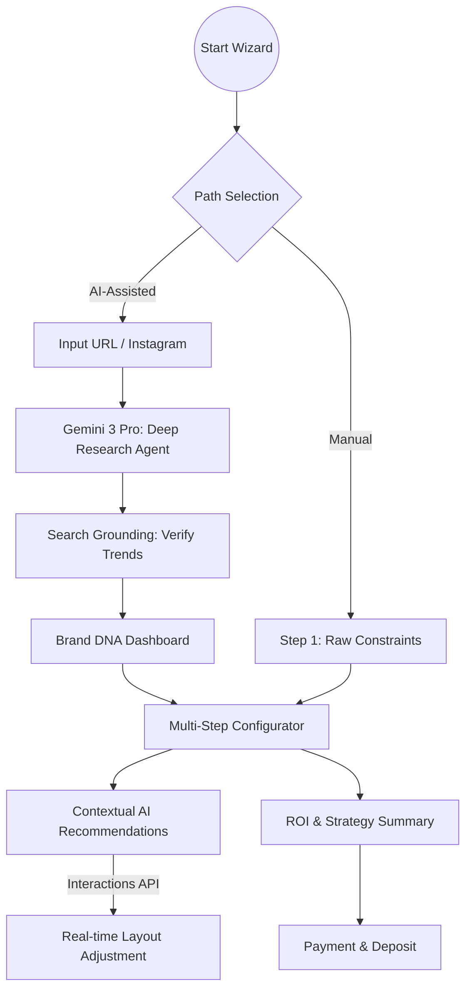

# 💎 FashionOS: AI Shoot & Campaign Wizard - Implementation Plan

**Role:** Lead Product Architect / AI Engineer  
**Status:** Architecture Design Phase  
**Tech Stack:** React 19, Vite, Tailwind CSS, Supabase, Gemini 3 (Pro/Flash)

---

## 📊 0. Progress Tracker: Shoot Wizard System

| Phase | Task | Status | Priority |
| :--- | :--- | :--- | :--- |
| **1. IA & UX** | Blueprint & Mermaid Flowcharts | 🟢 Complete | P0 |
| **2. Layout** | Editorial Shell & Step Controller | 🟡 In Progress | P0 |
| **3. AI Integration** | Brand DNA Agent (Gemini 3 Pro) | ⚪ Pending | P1 |
| **4. AI Integration** | Suggestion Engine (Gemini 3 Flash) | ⚪ Pending | P1 |
| **5. Commerce** | Pricing & Booking Ledger | ⚪ Pending | P2 |
| **6. QA** | Resilience & Fallback Tests | ⚪ Pending | P3 |

---

## 🗺️ 1. System Workflows

### The Intelligent Funnel (Mermaid)

---

## 🎨 2. Visual Identity & UI Components

### Style Guide (Luxury Editorial)
- **Typography:** 
  - `Playfair Display` for headlines (Tracking: -0.02em).
  - `Inter` for functional data (Weights: 300, 500, 700).
- **Color Palette:**
  - `Base`: #FCFBFA (Bone White)
  - `Accent`: #0A0A0A (Rich Black)
  - `AI Glow`: Linear Gradient (Purple #A855F7 to Rose #F43F5E) at 10% opacity.
- **Motion:**
  - **Parallax:** Hero images drift 5% on scroll.
  - **Transitions:** Step changes use a 400ms cross-fade with a slight 20px Y-axis lift.

---

## 🤖 3. Feature Architecture

### A. The "Digital Handshake" (URL Context Tool)
When a user inputs a URL, the system doesn't just scrape; it "understands."
- **Logic:** Gemini 3 Pro uses the `URL context tool` to identify product tiers (Luxury vs. Mass) and aesthetic leanings (Minimalist vs. Maximalist).
- **Action:** Pre-fills the "Visual Style" step with accurate descriptors and color palettes.

### B. The "Trend Grounding" Engine
- **Logic:** Calls `googleSearch` to verify if the suggested shoot theme (e.g., "Brutalist Concrete") is trending in Vogue or WGSN for the upcoming season.
- **Action:** Displays a "Verified by Search" badge with a tooltip link to the source.

---

## 📝 4. Implementation Prompts (Mega-Prompts)

### Prompt 1: The Core Wizard Layout & State
> "Act as a Senior Frontend Engineer. Create a multi-step `ShootWizard.tsx` component for FashionOS. 
> 
> **Requirements:**
> 1. Use a 'Flat Root' architecture.
> 2. Implement a progressive header showing 'Step X of 7' with a minimalist progress bar.
> 3. Create a layout with a main content area (left) and a collapsible 'AI Recommendation Sidebar' (right).
> 4. Use `framer-motion` for transitions between steps (1. Mode, 2. Intake, 3. Style, 4. Scenes, 5. Talent, 6. Deliverables, 7. Summary).
> 5. Style with Tailwind: font-serif for titles, 1px borders, and ultra-high-end whitespace. 
> 6. Ensure the Sidebar features a 'Gemini Sparkle' effect using a subtle gradient glow."

### Prompt 2: The Deep Research Edge Function
> "Act as an AI Backend Engineer. Write a Supabase Edge Function `audit-brand-dna` using the `@google/genai` SDK.
> 
> **Instructions:**
> 1. The function accepts a `brandUrl` and `instagramHandle`.
> 2. Use Gemini 3 Pro with `thinkingConfig` to analyze the brand's market position.
> 3. Integrate `googleSearch` to find the last 3 press mentions of the brand.
> 4. Return a structured JSON response including: `archetype`, `suggested_color_palette`, `target_audience_demographics`, and `market_positioning_score`.
> 5. Implement robust error handling for dead URLs."

### Prompt 3: The AI Recommendation Sidebar (Flash)
> "Create a React component `AIRecommendations.tsx`. 
> 
> **UI Requirements:**
> 1. A glassmorphic card that floats on the right side of the wizard.
> 2. It should display a 'Live Suggestion' that changes based on the active wizard step.
> 3. Include a 'Confidence Meter' (0-100%) and a 'Rationale' section explaining why the AI made the suggestion.
> 4. Include an 'Apply Suggestion' button that triggers a callback to update the wizard state.
> 5. Use Gemini 3 Flash via a hook to ensure low-latency updates as the user types."

---

## ✅ 5. Production Readiness & QA

### Troubleshooting Section
- **API Latency:** If Gemini takes >5s, display a 'Thinking' state with editorial brand copy (e.g., "Our agents are curating your aesthetic profile...").
- **Search Failures:** If Grounding returns no results, fall back to "Studio Best Practices" data stored locally.

### Acceptance Tests
- [ ] **T1:** Wizard successfully parses a valid URL and pre-selects a Shoot Category.
- [ ] **T2:** Sidebar updates suggestions within 500ms of a step change.
- [ ] **T3:** Total pricing updates live when 'AI Upgrades' (like Video BTS) are toggled.
- [ ] **T4:** Final summary generates a downloadable PDF brief.

---

## 📈 6. Success Metrics
- **Wizard Completion Rate:** >70%
- **AI Adoption:** 50% of users click 'Apply Suggestion' in the sidebar.
- **Strategic Impact:** AI-suggested themes lead to 20% higher click-through in simulated ad tests.