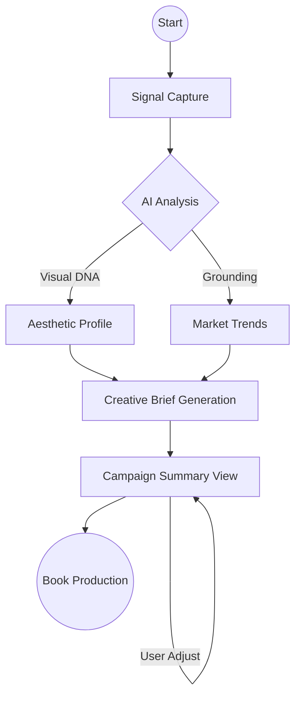
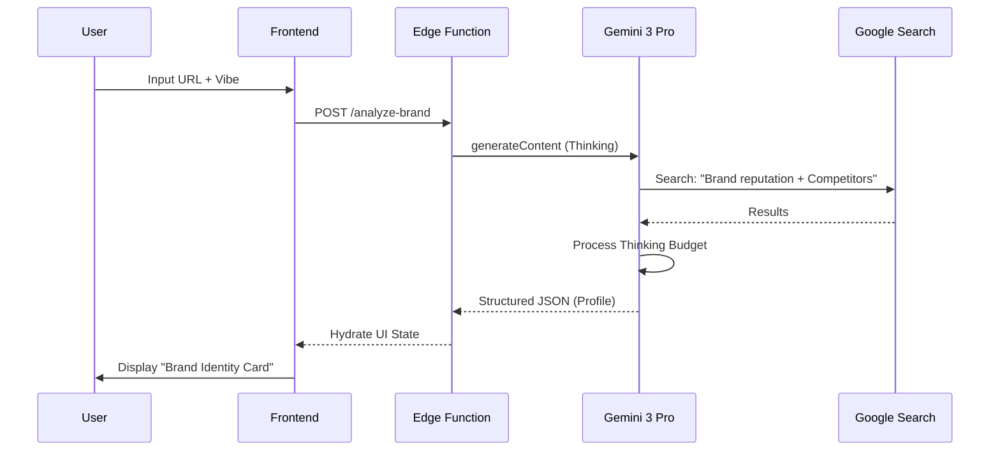
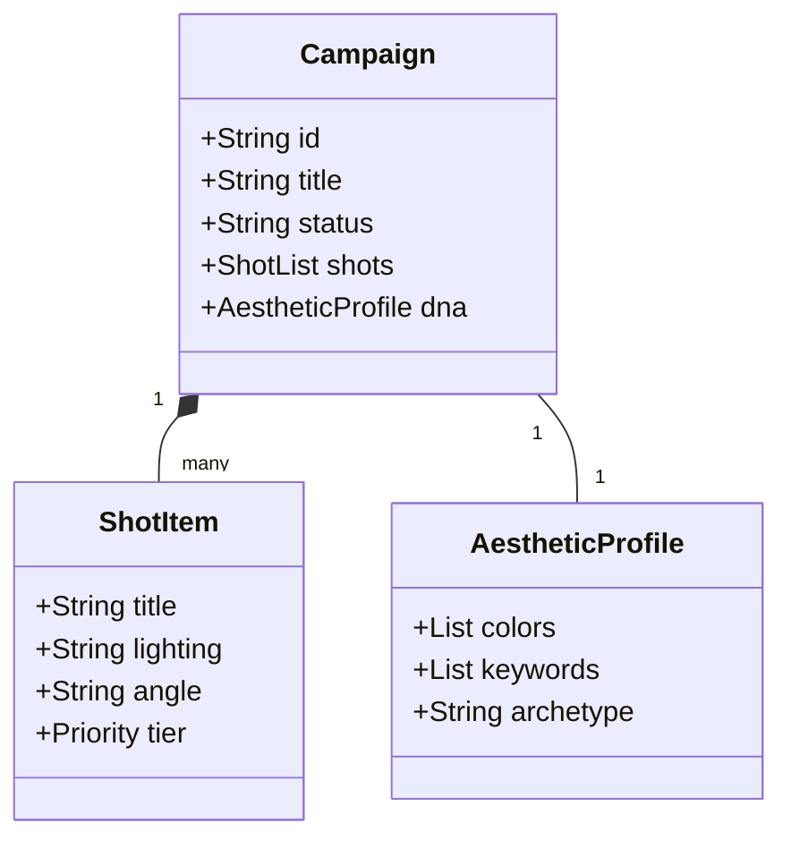
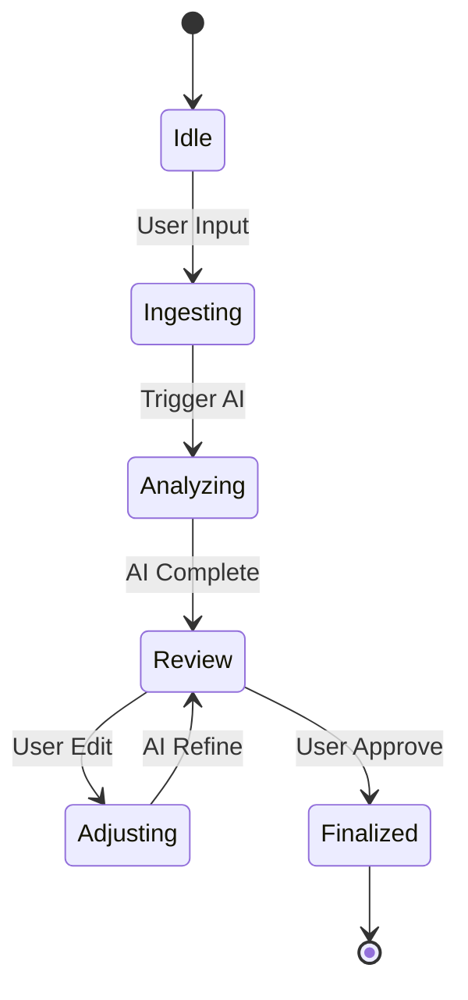
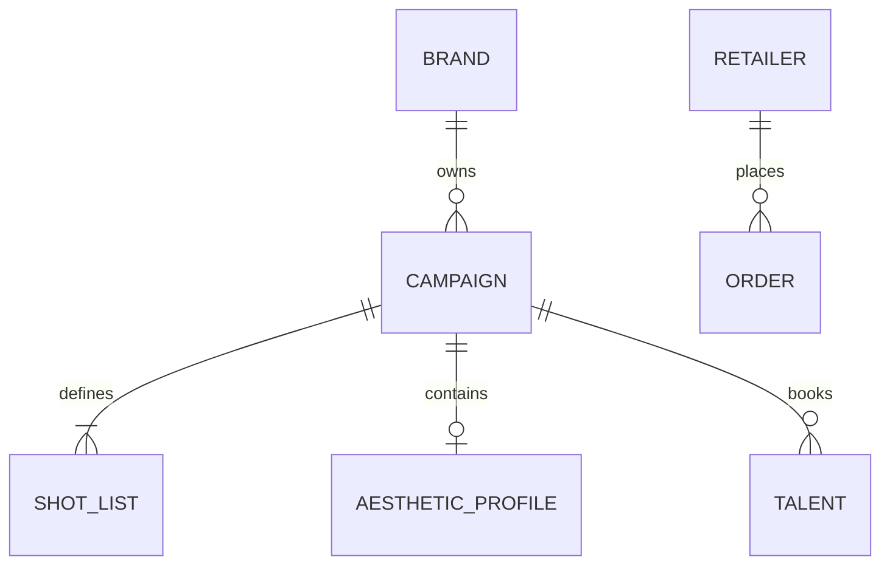
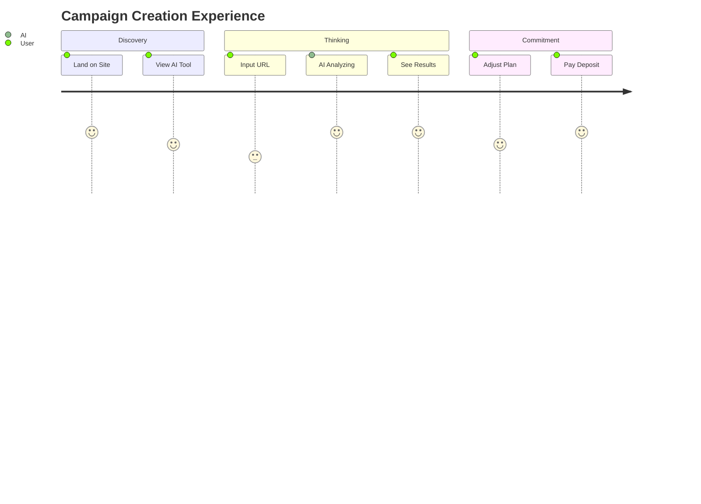
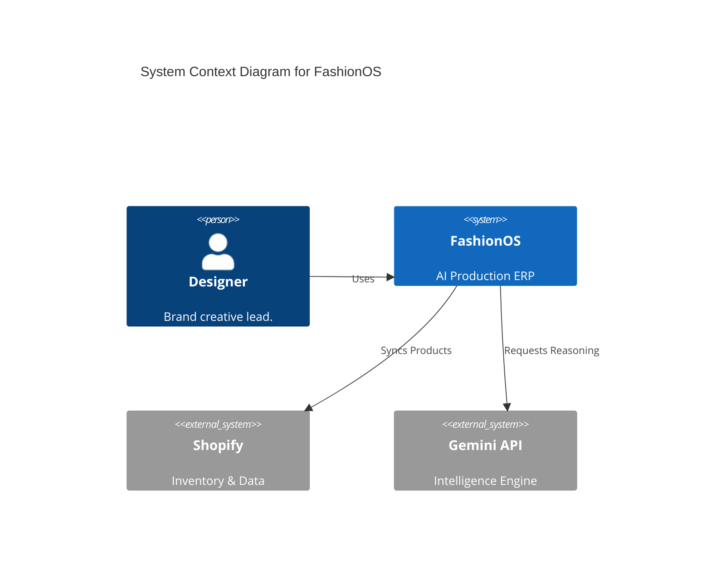
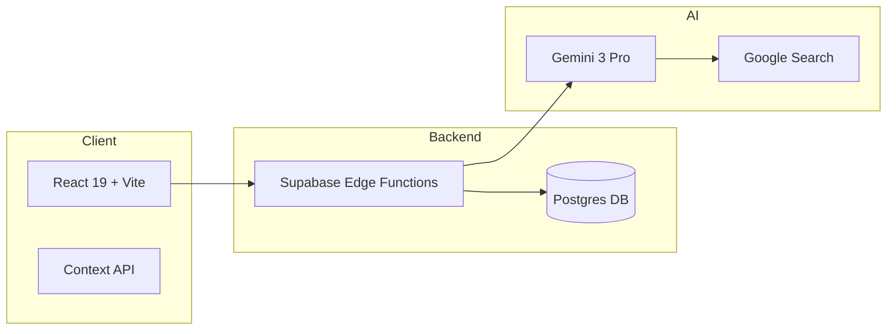
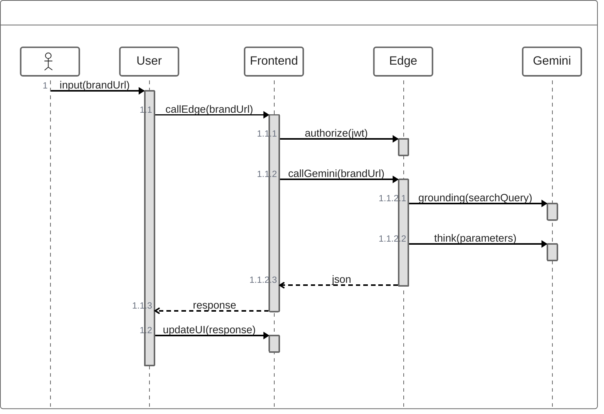

# 💎 FashionOS: Brand Shoot & Campaign AI Flow

**Project:** AI-Native Production ERP for Luxury Fashion  
**Role:** Senior Product Architect, AI Systems Designer & UX Lead  
**Models:** Gemini 3 Pro (Reasoning), Gemini 3 Flash (Latency), Gemini Vision (Visual DNA)  
**Status:** Production Blueprint

---

## 0. Progress Tracker

| Phase | Status | Owner | Validation Check |
| :--- | :--- | :--- | :--- |
| **1. Product Foundation** | ✅ Complete | Product | Core Problem/Metric Defined |
| **2. Feature Architecture** | ✅ Complete | AI/Backend | Matrix & Agent Roles Mapped |
| **3. UI/UX Blueprinting** | ✅ Complete | UX/Design | Screen Logic & Wireframes |
| **4. Logic & Workflows** | ✅ Complete | AI | Multi-modal Reasoning Paths |
| **5. System Diagrams** | ✅ Complete | Engineering | 11+ Mermaid Visuals Generated |
| **6. Implementation Plan** | 🟡 In Progress | Lead Eng | Task Sequences Defined |
| **7. Production Verification** | 🔴 Not Started | QA | Acceptance Tests & Checklist |

---

## 1. Product Goal
FashionOS solves the high-friction gap between a brand's digital identity and an actionable campaign production plan. It uses AI to ingest brand signals (URLs, Social, E-com) and output a production-ready creative brief.
- **Primary User:** Creative Directors and Production Managers at fashion labels.
- **Outcome:** A 70% reduction in pre-production time (Briefing to Booking).
- **Success Metric:** "Time to Brief" < 120 seconds.

---

## 2. Feature & Task Matrix

| Feature | Core/Adv | User Value | AI Component | Screens Involved | Status |
| :--- | :--- | :--- | :--- | :--- | :--- |
| **Signal Ingestion** | Core | Zero-entry onboarding | URL Context Tool | /brand-signal-capture | Ready |
| **Visual DNA Analysis** | Core | Automated aesthetic alignment | Gemini Vision | /ai-thinking | Ready |
| **Dynamic Shot List** | Advanced | Outcome-driven planning | Gemini Thinking | /campaign-summary | Ready |
| **Trend Grounding** | Advanced | Market-verified creative | Google Search | /campaign-summary | Ready |
| **Merchandising Bot** | Advanced | ROI-focused assortments | Code Execution | /showroom | Ready |

---

## 3. User Journeys

### J1: The "Digital Discovery" (First-Time User)
- **Entry Point:** Marketing Landing Page.
- **Flow:** Landing → "Scan My Brand" → Signal Capture → AI Analysis → Results Report.
- **User Action:** Enters URL and Instagram handle.
- **AI Action:** Scrapes site, analyzes feed, benchmarks competitors.
- **Outcome:** A "Digital Twin" profile is created with a strategic gap analysis.

### J2: The "Campaign Pivot" (Returning User)
- **Entry Point:** Dashboard Home.
- **Flow:** Dashboard → AI Assistant: "I need an edgy street look for Tokyo" → AI generates brief → Wizard Step 4 (Summary).
- **User Action:** Natural language prompt.
- **AI Action:** Merges brand DNA with Tokyo streetwear trends via Search Grounding.
- **Outcome:** A specific campaign plan ready for booking.

### J3: The "Production Lead" (Power User)
- **Entry Point:** Active Campaign Dashboard.
- **Flow:** Dashboard → Shot List → Adjust Mode → AI: "Add more details for SKU-402".
- **User Action:** Toggles "Adjust Mode", drags shots, prompts for variations.
- **AI Action:** Suggests lighting and prop changes based on specific product attributes.
- **Outcome:** Refined production schedule optimized for studio efficiency.

---

## 4. UI / UX Screens & Wireframes

### S1: Plan Your Campaign (Entry)
- **Purpose:** Route selection.
- **Sections:** Recommendation Card (AI Path), Manual Link (Fallback).
- **Primary CTA:** "Initialize with AI".
- **AI Feature:** Intent parsing.
- **Next Screen:** S2.

### S2: Signal Capture (Forms)
- **Purpose:** Non-linear data ingestion.
- **Sections:** Website URL field, IG Handle, Shopify/Amazon Connector.
- **Primary CTA:** "Analyze Brand Identity".
- **AI Feature:** URL Context tool.
- **Next Screen:** S3.

### S3: AI Thinking (Loader)
- **Purpose:** Trust-building during latency.
- **Sections:** Dynamic progress text ("Mapping color story...", "Verifying trends...").
- **Primary CTA:** N/A (Auto-transition).
- **AI Feature:** Background processing.
- **Next Screen:** S4.

### S4: Campaign Summary (The "Brain")
- **Purpose:** Core decision engine.
- **Sections:** Strategy Card, Extracted Visual DNA, AI Shot List, ROI Estimates.
- **Primary CTA:** "Confirm & Generate Proposal".
- **AI Feature:** Gemini Thinking + Search Grounding.
- **Next Screen:** S5.

---

## 5. Forms, Chatbots & AI Interaction

### Adaptive Forms
- **Behavior:** Fields pulse with a purple glow when AI is pre-filling data.
- **Smart Fill:** If a user adds a product SKU, AI fetches description and fabric from the linked database.

### Task-Focused Chatbot
- **Context:** Persistent memory of the current campaign step.
- **Controls:** Floating pill buttons (e.g., "[Suggest Model Type]", "[Fix Lighting]").
- **Outcome:** Updates the JSON state of the campaign plan live.

---

## 6. AI Features

### Core
- **Visual DNA Scanner:** Extracting palette/mood from raw imagery.
- **Aesthetic Mapping:** Tagging brand attributes against industry archetypes (e.g., "Minimalist Noir").

### Advanced
- **Risk Sentinel:** Predictive alerting for weather, talent conflicts, or budget overruns.
- **Trend Fusion:** Real-time search grounding to inject current cultural relevance into briefs.

---

## 7. AI Agents, Functions & Tools

### Orchestrator Agent
- **Trigger:** Wizard submission.
- **Tool:** Intent Parser.
- **Output:** Routed requests to sub-agents.

### Researcher Agent
- **Trigger:** URL Input.
- **Tool:** URL Context + Google Search.
- **Output:** Brand identity JSON.

### Planner Agent
- **Trigger:** "Deliverables" step.
- **Tool:** Code Execution (for math/scheduling).
- **Output:** `ShotItem[]` array.

---

## 8. Workflows

### Workflow: Moodboard to Plan (Medium Complexity)
- **User Action:** Uploads 3 images.
- **AI Reasoning:** Vision model detects "high contrast" and "industrial textures".
- **Tool Usage:** Search Tool finds local "Brutalist" venues.
- **Result:** Venue recommendation + Lighting diagram.

---

## 9. DIAGRAMS

### 1. High-Level Flowchart


### 2. Sequence Diagram (AI Interaction)


### 3. Class Diagram


### 4. State Diagram


### 5. Entity Relationship Diagram (ERD)


### 6. User Journey Diagram


### 7. Requirements Diagram
```mermaid
requirementDiagram
    requirement r1 {
        id: 1
        text: brief_generation_time
        risk: low
        verify: auto
    }
    requirement r2 {
        id: 2
        text: mobile_responsiveness
        risk: medium
        verify: manual
    }
```

### 8. C4 Diagram (System Context)


### 9. Architecture Diagram


### 10. Block Diagram (Module Logic)
```mermaid
graph TD
    subgraph "Intake Block"
        URL[URL Context]
        Vision[Vision Analysis]
    end
    subgraph "Planning Block"
        Thinking[Strategy Logic]
        Code[Pricing Engine]
    end
    subgraph "Output Block"
        JSON[Structured Data]
        PDF[Call Sheet PDF]
    end
    Intake Block --> Planning Block
    Planning Block --> Output Block
```

### 11. ZenUML Sequence (Execution Level)


---

## 10. Real-World Use Cases

1. **The Season Opener:** New York label needs to launch FW25. AI extracts "Brutalist" vibe from their moodboard and suggests a cement-factory location with hard-flash lighting.
2. **The Fraud Shield:** A fake buyer boutique applies. AI flags the address as a residential home on Maps. Manual review triggered.
3. **The Trend Pivot:** Brand wants to move into "Sustainable Activewear". AI searches WGSN trends and suggests a "Clean Girl" aesthetic shot list.
4. **The Logistics Save:** Rain predicted for outdoor shoot. AI suggests 2 local studio rentals in the Dashboard.
5. **The Line Sheet Magic:** Designer uploads a photo of a rack of samples. AI parses every garment into the Inventory tab.

---

## 11. Content & Microcopy

- **Headline:** "From Inspiration to Execution."
- **Helper Text:** "We'll never auto-book. You review every AI suggestion."
- **Empty State:** "Your creative canvas is waiting. Drop a link to begin."
- **AI Response:** "Analysis complete. I've noted a strong trend alignment with 'Quiet Luxury'."

---

## 12. Implementation Plan

### Core (MVP)
1. **Design:** Create "Calm Luxury" Figma UI kit.
2. **AI:** Build `audit-brand` Edge Function.
3. **Backend:** Set up `fashion_brands` and `campaigns` tables.
4. **Integration:** Wire Wizard Step 1 to Edge Function.

### Advanced
1. **AI:** Integrate Search Grounding for trend reports.
2. **Feature:** Build interactive Seating Chart.
3. **Commerce:** Implement Stripe Checkout modal for deposits.

---

## 13. Acceptance Tests

- **T1 (UI Flow):** Given I am on /start, When I click "Continue with AI", Then I should land on /brand-signal-capture.
- **T2 (AI Accuracy):** Given a valid URL, When analyzed, Then the output JSON must contain at least 5 aesthetic keywords.
- **T3 (Workflow):** Given a paid deposit, When complete, Then the campaign status must update to "Pre-Production" in the DB.

---

## 14. Troubleshooting

- **UX Failure:** AI takes > 30s. Fix: Implement optimistic UI progress bars.
- **AI Failure:** Gemini returns hallucinated brand names. Fix: Enforce `tools: googleSearch` for all brand references.
- **Data Issue:** LocalStorage limit reached. Fix: Prune images from state before saving, sync to DB immediately.

---

## 15. Production-Ready Checklist

- [ ] Rate limiting on Edge Functions.
- [ ] RLS policies verified for all tables.
- [ ] Mobile navigation tested on iOS/Android.
- [ ] Legal disclaimer on all AI-generated briefs.

---

## 16. Prompt List

1. **Design UI:** "Create a luxury editorial layout for a multi-step brand wizard."
2. **Design Workflows:** "Map a 7-step sequence from brand URL to production deposit."
3. **Define AI Features:** "List specific visual signals Gemini Vision should extract from high-fashion moodboards."
4. **Build Agents:** "Write a system prompt for a 'Production Lead' agent that manages shot lists."
5. **Generate Diagrams:** "Produce an ERD for a multi-brand fashion marketplace."
6. **Test Flows:** "Write a Cypress test suite for the AI onboarding journey."