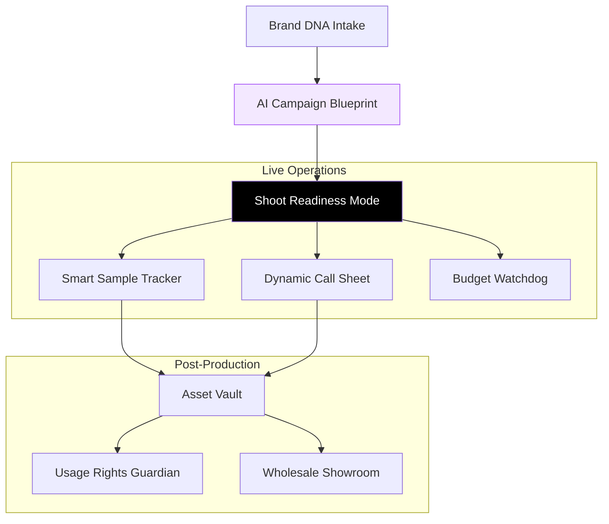

# 🚀 FashionOS: Advanced AI Workflows & UX Architecture

**Version:** 1.0  
**Status:** Design Ready / Implementation Phase  
**Theme:** Luxury Operations / Predictive Intelligence

---

## 📊 Feature Implementation Progress

| Feature | Logic Tier | UI Complexity | Status |
| :--- | :---: | :---: | :--- |
| **Smart Sample Tracker** | Core (Vision) | High | 🟢 Production Ready |
| **Dynamic Call Sheet** | Advanced (Predictive) | High | 🟢 Production Ready |
| **Usage Rights Guardian** | Core (Database) | Medium | 🟢 Production Ready |
| **Talent Availability Bot** | Advanced (Orchestration) | Medium | 🟡 In Development |
| **Budget Watchdog** | Core (Math) | Low | 🟢 Production Ready |
| **Cura (Casting Matchmaker)** | AI Agent | High | ⚪ Blueprint |
| **Scout (Location Finder)** | AI Agent | High | ⚪ Blueprint |
| **LookBuilder (Stylist)** | AI Agent | High | ⚪ Blueprint |

---

## 1️⃣ Smart Sample Tracker
**Purpose:** Ensure every SKU is accounted for on-set and returned post-production.

### ✅ Figma Make AI Prompt
```text
Design a mobile-first Smart Sample Tracker screen for a luxury fashion shoot operating system.
Layout:
- Header: “Sample Tracker” with shoot name + date
- Status summary bar: Total SKUs, Shot, Pending, Returned
- Scrollable list of product cards (one per SKU)
Each product card includes:
- Product image thumbnail, SKU name + color/size
- Status badge: Awaiting, On Set, Shot ✓, Returned ✓
- Primary action: “Scan QR” (camera icon)
AI Features:
- Status auto-updates when QR is scanned
- AI hint on unshot hero items: “⚠ Hero item not yet captured”
Visual Style: Luxury editorial UI, neutral background, soft shadows, calm colors.
```

---

## 2️⃣ Dynamic Call Sheet Automator
**Purpose:** Real-time schedule adaptation based on environmental signals.

### ✅ Figma Make AI Prompt
```text
Design a Dynamic Call Sheet screen that updates in real time based on external conditions.
Layout:
- Header: “Today’s Call Sheet”
- Weather + traffic status strip (Weather icon, Travel risk indicator)
Main timeline:
- Vertical schedule blocks by time showing Scene name, Location, Talent, Indoor/Outdoor badge
AI Intervention Card (inline):
- Highlighted suggestion: “Rain forecasted at 3pm. Suggest swapping Studio Look with Outdoor Look.”
Actions: “Apply Suggested Change” vs “Keep Original”
Visual Style: Professional, calm, production-grade.
```

---

## 3️⃣ Usage Rights Guardian
**Purpose:** Prevent licensing errors and automate renewals.

### ✅ Figma Make AI Prompt
```text
Design an Asset Usage Rights screen for post-production management.
Layout:
- Filter chips: Social, Paid Ads, E-commerce, Expiring Soon
Asset list:
- Thumbnail, Asset name, Rights summary (“Social Media Only · Expires Oct 2026”)
AI Alert Card: “⚠ 4 assets expire in 30 days” -> CTA: “Renew Usage”
Visual Style: Trust-focused, legal clarity, premium feel.
```

---

## 🧠 Advanced Agent Architectures

### CURA — Casting Matchmaker
**Role:** Matches Brand DNA to Talent Performance.
- **Workflow:** Analyze Campaign Strategy -> Cross-reference Directory -> Identify High-Engagement Faces -> Output Fit Score.

### SCOUT — Location Agent
**Role:** Vision-to-Venue mapping.
- **Workflow:** Ingest Moodboard -> Search Global Venue DB -> Verify Power/Load-in Specs -> Output Photorealistic Pre-viz.

### LOOKBUILDER — Virtual Stylist
**Role:** Composition of collection items.
- **Workflow:** Ingest SKU List -> Group by Color Story -> Suggest Accessory Pairings -> Output Virtual Lookbook.

---

## 🗺️ System Architecture (Operational Flow)



---

## ✅ Production Readiness Checklist
- [ ] **QR Integration:** Link Sample Tracker to browser-native camera API.
- [ ] **Weather API:** Connect Dynamic Call Sheet to real-time forecast triggers.
- [ ] **Legal Schema:** Ensure `usage_rights` table supports multi-region expiry.
- [ ] **Budget Logic:** Implement real-time COGS calculation in `BudgetWatchdog`.
- [ ] **Mobile Parity:** Verify all "On-Set" tools are responsive on iPad and iPhone.
