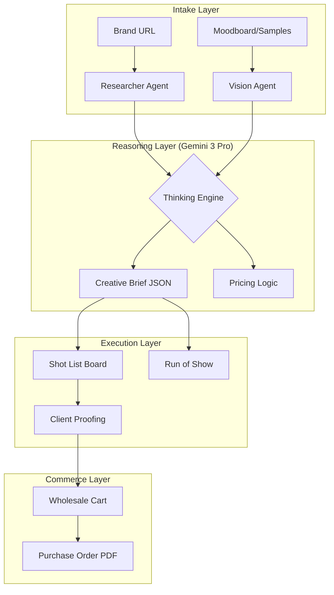
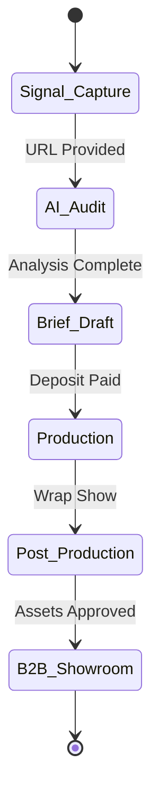

# 💎 FashionOS: Elite UI/UX & AI Workflow Plan (v2.0)

**Role:** Principal Product Designer & AI Systems Architect  
**Status:** Blueprint for Production Scaling  
**Theme:** Editorial Luxury / High-Fidelity Intelligence  
**Target:** Gemini 3 Pro & Imagen 4.0 Integration  

---

## 🏛️ 1. Visual Design Language: "The Blueprint of Luxury"

### Typography & Hierarchy
- **Primary Header:** `Playfair Display` (Serif). Tracking: -0.04em. Weight: 700. Used for emotional impact.
- **Data/UI:** `Inter` (Sans). Tracking: 0.02em. Weights: 400 (Body), 700 (Accents).
- **Technical Mono:** `IBM Plex Mono`. Used for SKUs, timestamps, and AI reasoning traces.

### Color Systems
- **Base:** `#FCFBFA` (Bone White) / `#0A0A0A` (Rich Black).
- **AI Accents:** 
  - `Intelligence Glow`: `linear-gradient(135deg, rgba(168, 85, 247, 0.15) 0%, rgba(244, 63, 94, 0.1) 100%)`
  - `Precision Green`: `#22C55E` (Verified status).
- **Borders:** 1px solid `#E5E5E5` (blueprint feel).

---

## 🗺️ 2. UX Architecture & User Journeys

### Journey A: The "Signal-to-Show" Pipeline
1. **Entry:** Brand Director lands on `/create-profile`.
2. **Analysis:** AI scans URL -> Extracts visual DNA -> Generates Brand Report.
3. **Intent:** Director clicks "Plan Runway Show" -> Launches `EventWizard`.
4. **Casting:** AI matches models from `Directory` based on extracted DNA.
5. **Execution:** On show day, Producer opens `ProductionDesk` (Live Mode).

### Journey B: The "B2B Fulfillment" Loop
1. **Intake:** Designer uploads rack photo -> AI parses SKUs to `/dashboard/products`.
2. **Setup:** Designer toggles "Available for Wholesale".
3. **Discovery:** Retailer finds brand in `Showroom` -> Adds to cart.
4. **Optimization:** AI Merchandiser suggests "Complete the Look" items to meet MOQ.
5. **Transaction:** PO generated -> Payment processed via `Stripe` -> Inventory updated.

---

## 🧠 3. AI Agent Logic & Automations

### Agent 1: "The Showrunner" (Production Logic)
- **Role:** Monitor the production timeline against real-world signals.
- **Logic:** `If (weather === 'Rain' && shoot_location === 'Outdoor') { Trigger (Reschedule_Prompt) }`.
- **UI:** Pushes "Action Required" cards to the dashboard top-bar.

### Agent 2: "Cura" (Casting & Aesthetic Matching)
- **Role:** Multimodal portfolio analysis.
- **Logic:** Compares campaign moodboard (Images) against talent portfolio (Images) using vector similarity.
- **UI:** Displays a "Match Score %" with a rationale block.

---

## 📝 4. Mega-Prompts for AI Generation

### Prompt 01: The "Digital Twin" Brand Wizard
> "Act as a Senior Frontend Engineer. Implement a 3-step 'Digital Twin' onboarding wizard.
> **Step 1 (Ingestion):** High-end URL input field with a pulsing 'Scan' animation.
> **Step 2 (The Lab):** A loading state that shows real-time 'Thinking' blocks (e.g., 'Extracting typography...', 'Sampling color palette...').
> **Step 3 (Identity Card):** A 10/12-grid layout. Left side shows a 3D-style 'Brand Identity Card' with hex codes and serif headers. Right side shows a 'Market Gap' SWOT analysis using Lucide icons.
> **Constraint:** Use 'Bone White' background and 1px 'Blue-Print' borders."

### Prompt 02: The Live "Production Desk" Console
> "Design a 'Mission Control' style dashboard for live event production.
> **Layout:** Dark mode (#050505 base).
> **Center:** A massive digital clock (HH:MM:SS) in a monospace font.
> **Main Feed:** A vertical 'Run of Show' timeline where the active segment is highlighted with a red 'LIVE' badge.
> **Sidebar:** A 'Crew Readiness' list showing talent names and their status (Makeup, Dressed, Ready).
> **Action:** A 'Trigger Next Cue' button that uses a heavy shadow and 0.5rem sharp radius.
> **Feature:** Integrate a 'Set Telemetry' widget that shows network latency and weather risk."

---

## 📊 5. System Diagrams

### Operational Logic (Mermaid)

### State Machine: Project Lifecycle

---

## 📱 6. Responsive Design Grid Rules

| Breakpoint | Layout Strategy | Element Behavior |
| :--- | :--- | :--- |
| **Desktop (1440px)** | 12-Column Grid | Fixed sidebars, center-stage canvas. |
| **Tablet (1024px)** | 8-Column Grid | Collapsible sidebars, masonry grids (2-col). |
| **Mobile (375px)** | Single Stack | Sticky bottom CTA, drawer-based navigation. |

---

## ✅ 7. Production Verification Checklist

- [ ] **Accessibility:** All editorial headers have appropriate ARIA labels.
- [ ] **Performance:** "Magic Import" (Vision task) handles 20+ images without blocking main thread.
- [ ] **Resilience:** If Gemini 3 Pro fails, system reverts to deterministic "Studio Standards" data.
- [ ] **Security:** RLS (Row Level Security) prevents Brand A from seeing Brand B's "Market Intelligence" reports.
