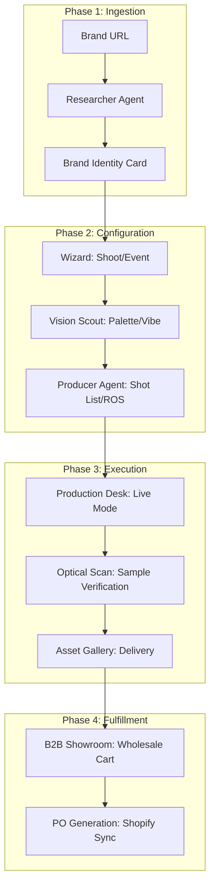

# 💎 FashionOS: High-Fidelity UI/UX & AI Workflow Blueprint

**Version:** 2.0  
**Role:** Lead Product Architect & AI Experience Engineer  
**Theme:** Editorial Luxury / Calibrated Intelligence  
**Focus:** Convergence of Creative Vision & Production Execution

---

## 🏛️ 1. Global Visual Language: "The Blueprint of Luxury"

### Typography Token System
- **Emotional Layer:** `Playfair Display` (Serif). Used for brand names, campaign headlines, and AI-generated visions.
- **Functional Layer:** `Inter` (Sans). Used for telemetry, navigation, and tabular data.
- **Technical Layer:** `IBM Plex Mono` (Mono). Used for SKUs, timestamps, and AI reasoning traces.

### Color Palette & Texture
- **Pure Neutral:** Bone White (#FCFBFA) for canvas, Rich Black (#0A0A0A) for structural elements.
- **Intelligent Glow:** 5% opacity gradients of Purple (#A855F7) and Rose (#F43F5E) to signify AI-active zones.
- **The "Glass & Grain" System:** 
  - `Backdrop Blur (2xl)` for persistent panels.
  - `Film Grain (0.03 opacity)` overlay on all media-heavy sections.
  - `Blueprint Lines (1px solid #E5E5E5)` for structural grids.

---

## 🗺️ 2. Core Workflows & System Logic

### End-to-End Campaign Lifecycle

---

## 📝 3. Mega-Prompts for AI System Generation

### Prompt 01: The "Digital Twin" Identity Wizard
> **Context:** `/create-profile`
> **Role:** Senior Product Designer.
> **Task:** Implement a 3-step brand onboarding flow.
> **Layout:** 
> - **Input:** Single-field URL entry with a "Digital Pulse" animation.
> - **Analysis:** A full-screen "Optical Scan" state showing Gemini's reasoning blocks.
> - **Result:** A 10-column grid. Left 4 columns show a 3D-styled "Identity Card" with color hex codes. Right 6 columns show a "Market Gap" analysis using radar charts.
> **AI:** Use Gemini 3 Pro with Search Grounding to verify competitor aesthetics.

### Prompt 02: The Live "Production Desk" (Dark Mode)
> **Context:** `/production`
> **Role:** Lead UI Engineer.
> **Task:** Create a mission-control interface for on-set production.
> **Visuals:** Strict Dark Mode (#050505). High-contrast white typography.
> **Sections:**
> - **Telemetry Bar:** Network latency, Weather risk, Golden Hour countdown.
> - **Center Canvas:** Massive serif text for the "Active Cue".
> - **Sidebar A:** "Crew Readiness" with toggle-status cards.
> - **Sidebar B:** "The Kill List" - AI-prioritized shots remaining before sunset.
> **AI:** Real-time velocity tracking (`stats.latency`) integrated into the header.

### Prompt 03: The "B2B Showroom" Assortment Planner
> **Context:** `/wholesale/showroom`
> **Role:** B2B UX Specialist.
> **Task:** Design a digital showroom for retail buyers.
> **Feature:** "AI Merchandiser" sidebar.
> **Logic:** As the buyer adds items to the cart, the AI analyzes the "Vibe Balance" (e.g., "70% Outerwear, 30% Basics").
> **UI:** Visual bar indicators for assortment health. "Complete the Look" suggestions based on the Brand's inventory DNA.

---

## 🧠 4. AI Agent Roles & Tool Usage

| Agent | Engine | Responsibility | Tools Used |
| :--- | :--- | :--- | :--- |
| **Architect** | Gemini 3 Pro | Strategic Brand Audit | URL Context, Search |
| **Visionary** | Gemini Vision | Aesthetic Extraction | Multi-modal Analysis |
| **Producer** | Gemini 3 Flash | Timeline & Logic | Code Execution |
| **Showrunner** | Gemini 3 Pro | Live Set Mitigation | Weather/Traffic Grounding |
| **Merchandiser** | Gemini 3 Pro | Assortment Optimization | Inventory Logic |

---

## 📱 5. Responsive Design Grid Matrix

| Element | Mobile (375px) | Tablet (1024px) | Desktop (1440px) |
| :--- | :--- | :--- | :--- |
| **Wizards** | Single Stacked Card | 2-Column Split | 10-Column Centered |
| **Dashboard** | Drawer Navigation | Collapsible Sidebar | Fixed Editorial Sidebar |
| **Gallery** | 2-Column Masonry | 3-Column Masonry | 5-Column Grid |
| **Showroom** | List View | Grid View | Immersive 3D Grid |

---

## ✅ 6. Production Readiness Gates

- [ ] **T1:** Zero-latency UI updates during manual field overrides.
- [ ] **T2:** Automated image compression to < 1MB for all AI Vision tasks.
- [ ] **T3:** RLS (Row Level Security) verified for all multi-brand marketplace data.
- [ ] **T4:** Fail-safe mode: Revert to local mocks if Gemini API exceeds 15s.